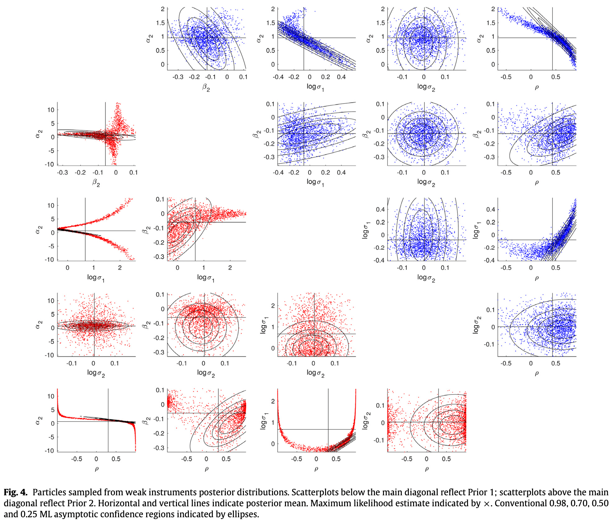

## Survol du cours 10

1. Échantillonnage préférentiel
1. Ré-échantillonnage
1. SMC (Monte Carlo séquentiel)
    a. Séquence de densités
    a. L'algorithme SMC
    a. Détails
    a. Exemple empirique

## Pourquoi SMC

1. Approche unifiée pour l'optimisation et la simulation des variables aléatoires.
1. Souvent meilleur que MCMC pour les problèmes où 
    a. la densité cible est multimodale, ou
    a. la matrice hessienne de la log densité cible varie beaucoup.
1. Parallélisme à exploiter.

## Une densité à quatre modes

La fonction de Himmelblau :
\[
  \phi(x) = (x_1^2 + x_2 - 11)^2 + (x_1 + x_2^2 - 7)^2.
\]

- Difficile à minimiser, un cas type pour les tests de performance.
- Non-négative, quatre racines :
$(-3.779,-3.283)$, $(-2.805,3.131)$, $(3,2)$, $(3.584,-1.848)$

Considérez une densité cible non-normalisée de la forme
\[
  h(x) = e^{-k\phi(x)},
\]
où $k \in (0,1]$ est un paramètre qui indique à quel point la fonction est hérissée.

## La densité $h(x)$ en R

```{r target_Himmelblau, cache=TRUE}
# La fonction de densité non-normalisée h(x)
h <- function(x, k) {
  ph <- (x[1]^2 + x[2] - 11)^2 + (x[1] + x[2]^2 - 7)^2
  exp(-k * ph)
}

# Évaluations sur une grille pour k=0.1, 1.0
library(lattice)
k_1 <- 0.1; k_2 <- 1
x_1 <- seq(-5, 5, by=0.02)
x_2 <- seq(-5, 5, by=0.02)
x_mat <- as.matrix(expand.grid(x_1, x_2))
colnames(x_mat) <- c('x', 'y')
df <- data.frame(h_1 = apply(x_mat, 1, h, k_1),
                 h_2 = apply(x_mat, 1, h, k_2), x_mat)
```

## Graphique pour $k=0.1$

```{r h_1, echo=FALSE, cache=TRUE}
wireframe(h_1 ~ x*y, data = df, shade=T)
```

## Graphique pour $k=1.0$

```{r h_2, echo=FALSE, cache=TRUE}
wireframe(h_2 ~ x*y, data = df, shade=T)
```

## Échantillonnage préférentiel (importance sampling)

- Le problème : intégrer des fonctions $g(x)$ par rapport à la densité $f(x)$, même si on peut seulement évaluer un noyau $h(x) = f(x)/c$, où $c$ est une constante inconnue.

- Une densité alternative (ou biaisée) est une $p(x)$ telle que
    - $h(x) > 0 \Rightarrow p(x) > 0$,
    - $\sup_x h(x)/p(x) < \infty$.
    
- Pour être utile, il faut pouvoir évaluer la densité alternative et simuler des
variables aléatoires de la loi alternative.

- Identités importantes de la population :
\[
  E_p\left[
    \frac{h(x)}{p(x)}
  \right] = \int \frac{h(x)}{p(x)} p(x)\, dx = \int h(x)\, dx = \frac{1}{c}.
\]
\[
  E_p\left[
    \frac{g(x)h(x)}{p(x)}
  \right]
  = \int \frac{g(x)h(x)}{p(x)} p(x)\, dx = \int \frac{f(x) g(x)}{c} \, dx
  = \frac{E_f[g(x)]}{c}.
\]

## Échantillonnage préférentiel (suite)

- Maintenant, supposons qu'on peut tirer $x^{(m)}$, $m=1,\ldots,M$ de la loi alternative (ayant
la densité $p(x)$).

- Si $E_f[g(x)]$ existe et une loi de grands nombres s'applique,
\[
  \frac{1}{M} \sum_{m=1}^M \frac{h(x^{(m)})}{p(x^{(m)})}
  = \frac{1}{M} \sum_{m=1}^M w^{(m)} \overset{p}{\to} \frac{1}{c}
\]
\[
  \frac{1}{M} \sum_{m=1}^M \frac{h(x^{(m)})}{p(x^{(m)})} g(x^{(m)})
  = \frac{1}{M} \sum_{m=1}^M w^{(m)} g(x^{(m)}) \overset{p}{\to} \frac{1}{c} E_f[g(x)],
\]
où $w^{(m)} \equiv h(x^{(m)})/p(x^{(m)})$.
- Et alors (par le théorème Mann-Wald ou continuous mapping theorem)
\[
  \frac{\sum_{m=1}^M w^{(m)} g(x^{(m)})}{\sum_{m=1}^M w^{(m)}} \overset{p}{\to} E_f[g(x)].
\]

## Autres notes sur l'échantillonnage préférentiel

- Les $w^{(m)}$ sont pareilles pour chaque choix de $g(\cdot)$ : une seule simulation, même pour plusieurs $g(\cdot)$.
- Dans un sens, l'échantillon pondéré $(w^{(m)}, x^{(m)})$ représente la loi cible.
- On peut faire les simulations de $p(x)$ par
    - tirages iid,
    - méthodes de réduction de variance,
    - nombres quasi-aléatoires aléatorisés,
    - méthodes MCMC.
- L'interprétation de l'intégration par l'échantillonnage préférentiel comme un changement de variables (Judd, pages 294-5) est très intéressante.

## L'erreur numérique de l'échantillonnage préférentiel

- Selon la méthode Monte Carlo utilisée pour tirer de $p(x)$, on obtient la variance numérique $\Sigma$ du vecteur $(n,d)$, où $n$ est le numérateur et $d$ est le dénominateur :
\[
  \Sigma = \begin{bmatrix} \sigma_n^2 & \sigma_{nd} \\ \sigma_{nd} & \sigma_d^2 \end{bmatrix}.
\]
- Selon la méthode delta multivariée, la variance numérique du ratio (l'estimateur numérique de $E_f[g(x)]$)
est $(r = n/d)$
\[
  \sigma_r^2 \approx \frac{1}{d^2} (\sigma_n^2 - 2r\sigma_{nd} + r^2\sigma_d^2).
\]
- Quand les tirages de $p(x)$ sont iid, la taille effective de l'échantillon, (Effective Sample Size, ESS) la taille d'un échantillon iid qui donnent la même erreur numérique, est
\[
  \frac{(\sum_{m=1}^M w_i)^2}{\sum_{m=1}^M w_i^2} \overset{p}{\to} \frac{\sigma^2/M}{\sigma_r^2},
  \quad \text{où}\; \sigma^2 = \mathrm{Var}_f[g(x)].
\]

## Exemple $h(x) = e^{-k\phi(x)}$ où $\phi(x)$ est la fct Himmelblau

```{r Himmelblau, include=FALSE}
ph <- function(x, y) {
  (x^2 + y - 11)^2 + (x + y^2 - 7)^2
}
Himmelblau <- outer(x_1, x_2, FUN=ph)
```

```{r w}
# Nombre de tirages de la loi alternative
M <- 1000
# La loi alternative est N(0_2, sigma^2 I_2)
mu <- 0; sigma <- 3
# Tirage de p(x)
rn <- rnorm(2*M, mean=mu, sd=sigma)
# Évaluation de log p(x) 
dn <- dnorm(rn, mean=mu, sd=sigma, log=TRUE)
x_rnd <- matrix(rn, nrow=M, ncol=2)
log_p <- rowSums(matrix(dn, nrow=M, ncol=2))
# Évaluation des densités cibles h1 et h2
log_h1 <- log(apply(x_rnd, 1, h, k_1))   # k = 0.1
log_h2 <- log(apply(x_rnd, 1, h, k_2))   # k = 1.0
# Poids pour les deux densités cibles
w1 = exp(log_h1 - log_p - max(log_h1 - log_p))
w2 = exp(log_h2 - log_p - max(log_h2 - log_p))
```

## ESS (Effective Sample Size)

```{r ESS}
f_ESS <- function(w) {
  sum(w)^2/sum(w^2)
}

f_ESS(w1)
f_ESS(w2)
M
```

## Poids préférentiels : $k = 0.1$

```{r EP_1}
contour(x_1, x_2, Himmelblau, xlab='x', ylab='y')
points(x_rnd, cex=2*sqrt(w1))
```

## Poids préférentiels : $k = 1.0$

```{r EP_2}
contour(x_1, x_2, Himmelblau, xlab='x', ylab='y')
points(x_rnd, cex=2*sqrt(w2))
```

## Rééchantillonnage (Resampling)

- À noter : un changement de notation pour être cohérent avec Geweke et Durham (2019), $\theta^{(m)}$ devient $\theta_n$.
- Problème : on a un échantillon $(w_n, \theta_n)$, $n=1,\ldots,N$, pour le noyau de densité $k(\theta)$, et on veut un échantillon $\theta_n^*$, $n=1,\ldots,N$, avec poids égaux pour $k(\theta)$.
- Solution : échantillonner $\theta_n^*$, $n=1,\ldots,N$, avec remise, de l'échantillon $\theta_n$, $n=1,\ldots,N$, avec les poids de probabilité $w_n$.
- Le nombre de fois $\theta_n$ se trouve dans l'échantillon $\theta_n^*$, $n=1,\ldots,N$, est binomial : $\mathrm{Bi}(N, w_n/\sum_{n=1}^N w_n)$.
- $\theta_n^*$, $n=1,\ldots,N$, est un échantillon pour $k(\theta)$.
- Attention : le rééchantillonnage ajoute du bruit. On le fait seulement si on a besoin d'un échantillon non-pondéré.

## L'exercice de simulation Monte Carlo séquentielle

* Simulation d'une suite de lois, avec noyaux de densité
$k^{(0)}(\theta),\, k^{(1)}(\theta),\, \ldots k^{(L)}(\theta)$, où
$k^{(0)}(\theta) = f^{(0)}(\theta)$ est normalisée.

* Il est facile de simuler la loi avec densité $f^{(0)}(\theta)$.

* Le dernier noyau de densité $k^{(L)}(\theta)$ est de la loi cible.

* Les lois intermédiaires peuvent être ou ne pas être de l'intérêt, mais
elles sont utiles pour diviser le problème en parties gérables.

* Un exemple courant :
    - $k^{(0)}(\theta) = 1_{[0,1]}(\theta)$
    - $k^{(L)}(\theta) = \tfrac{3}{5} f_{\mathrm{Be}}(70, 50) + \tfrac{2}{5} f_{\mathrm{Be}}(40, 160)$
    - $k^{(l)}(\theta) = [k^{(L)}(\theta)]^{l/L}$, $l=1,\ldots,L-1$.

```{r target, message=FALSE, warning=FALSE, cache=TRUE, include=FALSE}
defaultW <- getOption("warn")
options(warn = -1)
library(tidyverse)
library(reshape2)
L = 5
target_fcn <- function(x, T) {
  f = (0.6 * dbeta(x, 70, 50) + 0.4 * dbeta(x, 40, 160))^T
}
load('~/Library/Mobile Documents/com~apple~CloudDocs/ECN 6338/wx.RData')
load('~/Library/Mobile Documents/com~apple~CloudDocs/ECN 6338/W.RData')
```

## Illustration de l'exemple courant pour $L=5$

```{R k_sequence, echo=FALSE, message=FALSE, warning=FALSE}
x = seq(0, 1, by=0.001)
plot(x, target_fcn(x, 1.0), col='blue', 'l', xlab='theta', ylab='noyau de densité')
lines(x, target_fcn(x, 0.0), col='red')
lines(x, target_fcn(x, 0.2), col='green')
lines(x, target_fcn(x, 0.4), col='green')
lines(x, target_fcn(x, 0.6), col='green')
lines(x, target_fcn(x, 0.8), col='green')
```

## Quatre cas d'importance pratique

1. Problème de simulation a posteriori - revenu/refroidissement à l'exposant (power tempering)
\[
  k^{(l)}(\theta) = p_0(\theta) [p(y|\theta)]^{(l/L)}, \quad l=0, 1, \ldots, L.
\]
1. Problème de simulation a posteriori - revenu/refroidissement aux données (data tempering)
\[
  k^{(l)}(\theta) = p_0(\theta) \prod_{\tau=1}^{t_l} p(y_\tau|y_{1:\tau-1},\theta), \quad 0 = t_0 < t_1 < \ldots < t_L = T
\]
1. Problème de maximum de vraisemblance - recuit simulé
\[
  k^{(l)}(\theta) = p_0(\theta) [p(y|\theta)]^{\gamma_l}, \quad 0 = \gamma_0 < \gamma_1 < \ldots
\]
1. Problème de filtrage, où $x_t$ est une suite d'états latente
\[
  p(x_t|y_{1:t}), \quad t=1,\ldots,T.
\]

Les lois intermédiares peuvent être de l'intérêt dans les cas 2 et 4.

## L'algorithme SMC (version de Geweke et Durham (2019))

### Initialisation

Tirer $\theta_n^{(0)} \sim f^{(0)}(\theta)$, $n=1,\ldots,N$, pour avoir un échantillon $(N^{-1}, \theta_n^{(0)})$ qui représente $f^{(0)}(\theta)$.

### Itération pour $l=1,\ldots,L$

1. Phase C (Correction, avec échantillonnage préférentiel)
    - L'intrant, un échantillon $(N^{-1}, \theta_n^{(l-1)})$, représente $k^{(l-1)}(\theta)$.
    - On calcule $w_n^{(l)} = k^{(l)}(\theta_n^{(l-1)})/k^{(l-1)}(\theta_n)$.
    - Le résultat est un échantilon $(w_n^{(l)}, \theta_n^{(l-1)})$ qui représente $k^{(l)}(\theta)$.

1. Phase S (Sélection, avec ré-échantillonnage)
    - On ré-échantillonne l'échantillon pondéré $(w_n^{(l)}, \theta_n^{(l-1)})$, qui représente $k^{(l)}(\theta)$.
    - Le résultat est un échantillon $(N^{-1}, \theta_n^{(l,0)})$ qui représente $k^{(l)}(\theta)$.

1. Phase M (Mutation, avec transtions MCMC)
    - Pour chaque $\theta_n^{(l,0)}$, effectuer $K_l$ itérations d'une transition markovienne
    qui préserve la loi avec noyau de densité $k^{(l)}(\theta)$ : $\theta_n^{(l,\kappa)}$,
    $\kappa = 1,\ldots,K_l$. Garder $\theta_n^{(l)} = \theta_n^{(l,K_l)}$.
    - Le résultat est un échantillon $(N^{-1},\theta_n^{(l)})$ qui représente $k^{(l)}(\theta)$.

## Deux premiers cycles: $(C, S, M \times 5) \times 2$

```{r cycle_two, echo=FALSE, message=FALSE, warning=FALSE}
library(ggplot2)
source('SMC.R')
SMC_plot <- ggplot(data=wx[wx$t<=15,], aes(x=t, y=x, size=w)) + geom_point(aes(colour=k)) + geom_line(aes(x=t, y=xs, group=m), size=0.5, alpha=0.2) + labs(y="x", x="stage") + ggtitle(NULL) + scale_size_continuous(range=c(0.5, 4))

SMC_plot
```

## Tous les cinq cycles

```{r cycle_five, echo=FALSE, message=FALSE, warning=FALSE}
SMC_plot <- ggplot(data=wx, aes(x=t, y=x, size=w)) + geom_point(aes(colour=k)) + geom_line(aes(x=t, y=xs, group=m), size=0.5, alpha=0.2) + labs(y="x", x="stage") + ggtitle(NULL) + scale_size_continuous(range=c(0.5, 4))

SMC_plot
options(warn = defaultW)
```

## Déplétion des particules (ESS = 26.8, 21.0, 17.6, 15.5, 14.1) si on fait seulment la phase C

```{r depletion, echo=FALSE, message=FALSE, warning=FALSE}
SMC_plot <- ggplot(data=WX, aes(x=t, y=X, size=W)) + geom_point() + labs(y='x', x='stage')

SMC_plot
```

## Quelques détails

Deux questions à résoudre pour mettre en oeuvre l'algorithme :

1. Comment sélectionner la séquence $k^{(l)}(\theta)$, $l=1,\ldots,L-1$, entre
$f^{(0)}(\theta)$ et la cible $k^{(L)}(\theta)$?
1. À la phase $M$ de l'itération $l$, comment choisir le nombre d'itérations $K_l$ dans la phase M et quelles transitions markoviennes à utiliser?

L'idée d'adaptation (version naive)

1. Rappelons les deux cas : revenu à l'exposant et revenu aux données.
On choisit $k^{(l)}(\theta)$ dans la phase $C$ en allant vers la cible $k^{(L)}(\theta)$ jusqu'au point que la ESS atteint un seuil toujours acceptable.
1. On choisit les paramètres des transitions (par exemple, la variance de la proposition Metropolis) et leur nombre pour atteindre un seuil d'efficacité numérique jugé acceptable.

## Quelques détails (cont.)

Pourquoi cette version de l'idée est-elle naïve?

- Les théorèmes qui justifient l'algorithme (loi de grands nombres, théorème central limite)
reposent sur la nature markovienne de la simulation.
- Les décisions à faire dépendent de toute l'histoire de simulation alors la version adaptative n'est pas markovienne.

La solution :

- Executer deux versions de l'algorithme, en ordre :
    1. Une version adaptative, où on enregistre toutes les décisions, comme les $k^{(l)}(\theta)$, les $K_l$, les variances des propositions Metropolis.
    1. Une version non-adaptive où on utilise toutes les mêmes décisions utilisées dans la version adaptative.
- Utiliser seulement les résultats de la deuxième version.

## Calcul des erreurs numérique

- Geweke et Durham (2019) modifie l'algorithme pour organiser les particules en $J$ groupes de $N$ particules.
- À la fin de l'itération $l$, les particules sont $\theta_{jn}^{(l)}$, $j=1,\ldots,J$ et $n=1,\ldots,N$, pour un total de $JN$ particules.
- À la phase S, le rééchantillonage se fait groupe par groupe : pour chaque groupe $j$, on sélectionne $\theta_{jn}^{(l,0)}$, $n=1,\ldots,N$, seulement parmi les particules pondérées $(w_{jn},\theta_{jn}^{(l)})$ du groupe $j$.
- En conséquence, l'efficacité numérique diminue mais les $J$ échantillons de taille $N$ sont indépendants.
- Pour $j=1,\ldots,J$, soit $\bar{g}_j \equiv N^{-1}\sum_{n=1}^N g(\theta_{jn}^{(L)})$ l'estimation de $E_{f^L}[g(\theta)]$ à partir des particules $\theta_{jn}^{(L)}$, $n=1,\ldots,N$, du groupe $j$.
- Alors l'estimation globale $\bar{g} = J^{-1}\sum_{j=1}^J \bar{g}_j$ a une variance numérique asymptotique (en $J$ et $N$) estimée par
\[
  \hat{\sigma}_g^2 = J^{-1} \sum_{j=1}^J (\bar{g}_j - \bar{g})^2.
\]

## Parallélisme

- Computation qu'on peut faire en parallèle pour chaque particule :
    - Simulation préliminaire de $f^{(0)}(\theta)$
    - Computation des poids préférentiels
    - Rééchantillonage (une fois qu'un tableau de probabilités est construit)
    - Mutation. Par exemple,
        - Tirage d'une proposition Metropolis
        - Computation de la ratio de Hastings
        - Tirage d'une $U(0,1)$ pour la règle d'acceptation ou rejet
    - Évaluation des fonctions $g(\cdot)$, particule par particule

- Ce qu'on ne peut pas faire de façon parallèle est trivial :
    - Tableau de probabilités (computation préliminaire pour le rééchantillonage)

- Souvent, le parallélisme n'est pas seulement
    - "embarassant", dans le sens du manque de communication entre particules, mais aussi
    - SIMD, dans le sens qu'on fait les mêmes opérations (mais avec l'information locale) pour chaque particule.

## Exemple empirque de Geweke et Durham (2019)


