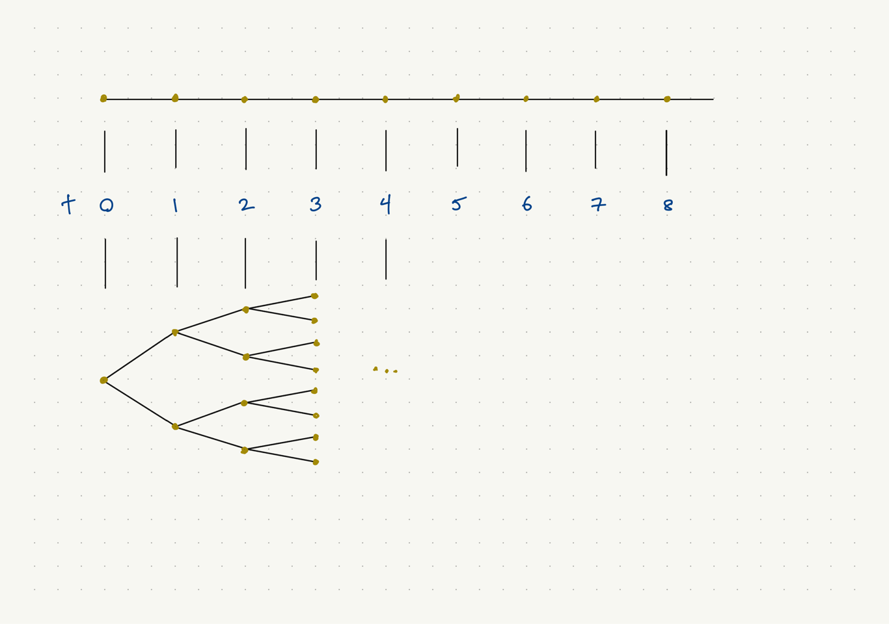

## Un problème d'optimisation dynamique déterministe à horizon fini

- Objectif :
\[
  \sum_{t=1}^T \pi(x_t, u_t, t) + W(x_{T+1}),
\]
où
    - $t$ est l'index du temps,
    - $x_t$ est l'état en période $t$, $t=1,\ldots,T+1$,
    - $u_t$ est la commande (une variable de choix, control en anglais),
    - $\pi(\cdot)$ est le flux de valeur (souvent profit où utilité),
    - $W(\cdot)$ est la valeur terminale.

- Contraintes :
    - $x_1$ donné,
    - $x_{t+1} = F(x_t, u_t, t)$, $t=1,\ldots,T$,
    - $u_t \in D(x_t, t)$, $t=1,\ldots,T$.

## La version à horizon infini

- L'objectif devient
\[
  \sum_{t=0}^\infty \beta^t \pi(x_t, u_t).
\]
    - le temps commence à zéro,
    - il n'y a pas de valeur terminale,
    - cas très spécial de $\pi(x_t, u_t, t)$ : $\beta^t \pi(x_t, u_t)$.
    
- Quant aux contraintes :
    - $F(x_t, u_t)$ au lieu de $F(x_t, u_t, t)$ (pas vraiment une restriction)
    - $u_t \in D(x_t)$ au lieu de $D(x_t, t)$
    - $x_0$ donnée au lieu de $x_1$.

## Un exemple : accumulation de la richesse

- Le modèle :
\[
  \max_{c_t} \sum_{t=0}^\infty \beta^t u(c_t) \quad \text{t.q.} \quad k_{t+1} = F(k_t) - c_t,
  \; k_0 \; \text{donné},
\]

- Notes :
    - L'état est le stock du capital : $x_t = k_t$
    - La commande est la consommation : $u_t = c_t$
    - $F$ est une fonction de production d'un bien homogène (pas de distinction entre le capital et le seul bien de consommation).
    - On peut inclure l'amortissement du capital dans $F$ : $F(k) = f(k) - \delta k$, où $f(k)$ est la fonction de production grosse.
    - Une interprétation du problème : celui du planificateur central dans un modèle simple de
    croissance néoclassique : il y a un équilibre concurrentiel qui donne la même
    résultat.

## Autres exemples

- Problème d'un monopôle :
    - la commande est la quantité de travail $l$ et le dividende $c$
    - l'état est la quantité de capital $k$ dans la firme
    - l'état prochain est le profit (comme fonction de $l$ et $k$) moins le dividende
    - le flux de valeur est le dividende versé dans une période

- Problème d'inventaire agricole (Judd, 428)
    - la commande est le choix d'intrants de production agricole
    - l'état est l'inventaire agricole
    - l'état prochain est la production moins la consommation
    - le flux de valeur est l'utilité de la consommation d'une période
    
- Problème de gestion d'un forêt
    - la commande est la quantité récoltée de chaque type (age) d'arbre,
    - l'état est la quantité de chaque type d'arbre,
    - l'état prochain est déterminé par la croissance des arbres et les quantités récoltées,
    - le flux de valeur est le profit apporté par la récolte d'une période
    
## La fonction de valeur

La fonction de valeur est comme une fonction d'utilité indirecte :

- Soit $u(x,y)$ la fonction d'utilité pour deux biens, en quantités $x$ et $y$.
- La contrainte budgétaire est $p_x x + p_y y = m$.
- La fonction d'utilité indirecte est
\[
  v(p_x, p_y, m) = \max_{x,y} u(x,y) \quad \text{t.q.} \quad p_x x + p_y y = m.
\]

La fonction de valeur pour le problème à horizon fini est
\[
  V(x,t) = \sup_{u_t,\ldots,u_T} \sum_{s=t}^T \pi(x_s, u_s, s) + W(x_{T+1}),
\]
sous les contraintes

- $x_t = x$,
- $x_{s+1} = F(x_s, u_s, s)$, $s=t,\ldots,T$,
- $u_s \in D(x_s, s)$, $s=t,\ldots,T$.

## Le principe d'optimalilté de Bellman

> Une commande optimale $u_t,\ldots,u_T$ a la propriété que quelque soit l'état initial $x_t$ et la décision initiale $u_t$, les décisions restantes ($u_{t+1},\ldots,u_T$) doivent être une commande optimale pour l'état $x_{t+1} = F(x_t, u_t, t)$ résultant de la décision $u_t$.

Notes :

- Un relation entre fonctions de valeur de différentes périodes :
\[
  V(x,t) = \sup_{u \in D(x,t)} \pi(x,u,t) + V(F(x, u, t), t+1).
\]
- Si $u \in D(x,t)$ atteint le sup, la fonction de politique est
\[
  U(x,t) = \arg\max_{u \in D(x,t)} \pi(x,u,t) + V(F(x, u, t), t+1).
\]
- $U(x,t)$, $V(x,t)$ sans mémoire, fonctions seulement de $x$ et $t$.

## Trouver la fonction de valeur $V(x, 1)$

- Une condition terminal : $V(x,T+1) = W(x)$, une fonction connue.
- Les autres $V(\cdot,t)$ par raisonnement rétrograde : application de l'opérateur
définie par
\[
  V(x,t) = \sup_{u \in D(x,t)} \pi(x,u,t) + V(F(x, u, t), t+1).
\]
- Attention : l'opérateur prend une fonction de $x$ et donne une fonction de $x$.

## Le problème déterministe à horizon infinie

- La fonction de valeur est maintenant définie de façon récursive :
\[
  V(x) = \sup_{u \in D(x)} \pi(x,u) + \beta V(F(x, u)),
\]
ou $V = TV$; $V$ est une fonction de $x \in X$, $T$ est un opérateur.
- La solution résout une équation *fonctionnelle*.
- Le théorème des applications contractantes (contraction mapping theorem) :
si $0 < \beta < 1$, $\pi(x,u)$ est borné et $X$ est compacte,
    - $T$ est monotone ($y_1 \geq y_2 \Rightarrow Ty_1 \geq Ty_2$)
    - $T$ est une contraction de module $\beta$
    ($\|Ty_1 - Ty_2\| \leq \beta \|y_1 - y_2\|$)
    - $V = TV$ a une solution ($T$ a un point fixe) unique.
- La fonction de politique est maintenant
\[
  U(x) \in \arg\max_{u \in D(x)} \pi(x,u) + \beta V(F(x, u)).
\]

## Comment appliquer l'operateur en pratique

- Prenons l'exemple de l'accumulation de richesse.
- La fonction de valeur est un point fixe de l'opérateur $T$, où
\[
  (TV)(k) \equiv \max_{0 \leq c \leq F(k)} u(c) + \beta V(F(k) - c).
\]
- Comment trouver une approximation de $V(k)$?
- Une méthode : permettre seulement les valeurs de $k$ sur une grille
$K = \{k^m,\ldots,k^M\}$.
- En pratique il faut prendre $k^+ \equiv F(k) - c$, le capital à la prochaine période,
comme la variable de commande.
- L'équation Bellman avec le changement de variables :
\[
  V(k) = \max_{k^+ \geq 0} u(F(k) - k^+) + \beta V(k^+).
\]
- L'équation Bellman avec $V \colon K \to K$ au lieu de $V \colon \mathbb{R}_+ \to \mathbb{R}_+$ :
\[
  V(k) = \max_{k^+ \in K} u(F(k) - k^+) + \beta V(k^+).
\]
- Elle est un système d'équations non-linéaire; la solution est un vecteur.

## Exemple

Prenons :

- $\beta = 0.96$
- $u(c) = c^{\gamma + 1}/(\gamma + 1)$, $\gamma = -2$.
- $F(k) = k + f(k)$, où $f(k) = \frac{1-\beta}{\alpha\beta} k^\alpha$, $\alpha = 0.25$
- $K = \{0.8, 0.8 + \kappa, 0.8 + 2\kappa, \ldots, 1.2\}$.

Notes :

- $k^{ss}$ est un état stationnaire si $k^{ss} + F(k^{ss}) - C(k^{ss}) = k^{ss}$.
- $\beta$ dans la fonction de production est étrange, le coefficient $(1-\beta)/(\alpha\beta)$ fait en sorte que $k^{ss} = 1$.

## Choisir une fonction de valeur initiale

- La commande $C(k) = f(k)$ est faisable, mais pas optimal si $k \neq 1$.
- Autour de $k=k^{ss}$, $C(k)$ devrait être près de la commande optimale.
- La commande tient constant l'état $k$.
- La fonction de valeur $V^c(k)$ associée à la commande $C(k)$ vérifie
\[
  V^c(k) = u(f(k)) + \beta V^c(k), \; \text{ou} \; V^c(k) = u(f(k))/(1-\beta).
\]
- Notez que $V^c(k) \leq V(k)$, où $V(k)$ est la fonction de valeur de la politique optimale.
- Considérez aussi $V_z(k) = 0$ comme fonction de valeur initiale.

## Code initial : préférences et technologies

```{r elements1}
# Valeurs des paramètres
gamma <- -2.0   # Paramètre de préférence
beta <- 0.96    # Paramètre d'impatience
alpha <- 0.25   # Paramètre de production

# Fonction d'utilité
u <- function(c) {
  ifelse(c>0, c^(gamma + 1)/(gamma + 1), -Inf)
}

# Fonction de production
f <- function(k) {
  ((1-beta)/(alpha*beta)) * k^alpha
}
```

## Code initial : grille et précomputation

```{r elements2}
# Grille de capital
kappa <- 0.001
k <- seq(0.5, 1.5, by=kappa)
N <- length(k)

# Matrice de valeurs de u(k + f(k) - k+)
u_k <- function(k, kplus) {
  u(k + f(k) - kplus)
}
u_tab <- outer(k, k, u_k)

# Fonction de valeur initial, épargne zéro
V_c <- u(f(k))/(1-beta)

# Fonction de valeur initial, zéro
V_z <- rep(0, N)
```

## Code, itération de la fonction de valeur 

```{r VF_iteration}
# Iteration de la fonction de valeur
VU_suiv <- function(V) {
  V_suiv <- rep(0, N);
  U_suiv <- rep(0, N); U_suiv_i <- vector('integer', N)
  for (i in 1:N) {
    # k[i_plus] est la commande optimale à l'état k[i]
    i_plus = which.max(u_tab[i,] + beta*V)
    U_suiv[i] = k[i_plus]; U_suiv_i = i_plus
    # V_suiv[i] est la fonction V suivante à l'état k[i]
    V_suiv[i] = u_tab[i, i_plus] + beta*V[i_plus]
  }
  list(V=V_suiv, U=U_suiv, U_i=U_suiv_i)
}

# Une itération de T à partir de V_c
VUs_c <- VU_suiv(V_c)
```

## La fonction de valeur $TV_c(k)$ (une itération)

```{r graphique_val_c}
plot(k, V_c, type='l')
lines(k, VUs_c$V, col='green')
```

## La fonction de politique après une itération de $V_c(k)$

```{r graphique_pol}
plot(k, VUs_c$U, type='l')
lines(k, k, lty='dashed', col='grey')
```

## Les fonctions de valeur $T^{i}V_z(k)$, $i=1,2,3$

```{r graphique_val}
plot(k, V_z, type='l', ylim = c(-160, 0)); V = V_z
for (i in 1:3) {
  V <- VU_suiv(V)$V; lines(k, V, col='green')
}
```

## Itération de la fonction de politique : approximation de $V^U$ pour $U$ donnée

- Pour une fonction de politique $k^+ = U(k)$, pas forcément optimale,
on peut calculer, pour chaque $k_0 \in K$, la suite d'état
\[
  k_0, U(k_0), U^{(2)}(k_0), U^{(3)}(k_0), \ldots,
\]
où $U^{(0)}(k_0) = k_0$, $U^{(i+1)}(k_0) = U(U^{(i)}(k_0))$.
- On peut approximer la fonction de valeur de cette politique, le vecteur $V^U(k_0)$, $k_0 \in K$ par $\hat{V}^U(k_0)$ défini comme
\[
  \sum_{t=0}^T \beta^t u(U^{(t)}(k_0) + f(U^{(t)}(k_0)) - U^{(t+1)}(k_0)) + \beta^{T+1}\tilde{V}(U^{(T+1)}(k_0)),
\]
où $\tilde{V}$ est une approximation de la fonction de valeur optimale.
- Si on fait ce calcul directe pour chaque $k_0$ il peut y avoir des calculs redondants; pire, le calcul directe ne marche pas pour les problèmes analogues stochastiques.

## La version rétrograde de l'approximation de $V^U$

Cette version rétrograde évite des calculs redondants et se généralise aux problèmes stochastiques, équation (12.4.2) de Judd :

- $W^0 = V$ (vecteur!)
- Pour $j=0,\ldots,T$ :
    - Pour $k \in K$,
    \[ W^{j+1}(k) = u(k + f(k) - U(k)) + \beta W^{j}(U(k)). \]
- $V^U \approx \hat{V}^U \equiv W^{k+1}$ (vecteur!)

## Itération de la fonction de politique

Itérez les étapes suivantes jusqu'à ce que $\|V^{l+1} - V^l\| < \epsilon$ :

1. Utilisez $V^l$ pour calculer $U^{l+1}$, la fonction de politique sous-produite par l'itération de la fonction de valeur.
1. Utilisez $U^{l+1}$ et $V^l$ (pour la valeur résiduelle à $t=T+1$) pour calculer $V^{l+1}$ comme
\[
  V^{l+1} \equiv \hat{V}^{U^{l+1}}
\]

## Problèmes dynamiques avec incertitude

- Soit $X$ l'ensemble d'états possibles.
- Rappel, évolution des états dans les modèles déterministes :
\[
  x_{t+1} = F(x_t, u_t, t) \quad \text{ou} \quad x_{t+1} = F(x_t, u_t).
\]
- Dans les modèles stochastiques, l'évolution de l'état devient stochastique :
\[
  F(A, x_t, u_t, t) \equiv \Pr[x_{t+1} \in A | x_t, u_t, t],\; A  \subseteq X.
\]
- Le problème général est la maximisation de
\[
  E\left[
    \sum_{t=1}^T \pi(x_t, u_t, t) + W(x_{T+1})
  \right]
   \quad \text{ou} \quad 
  E\left[
    \sum_{t=0}^\infty \beta^t \pi(x_t, u_t)
  \right].
\]
sous les contraintes décrites en termes de $F(\cdot)$, $D(\cdot)$ et $x_0$.
- Notez la séparabilité et la linéarité :
    - temporelle dans les problèmes déterministes et stochastiques,
    - l'espérance dans les problèmes stochastiques.

## Structure intertemporelle avec incertitude



## Les équations de Bellman dans le cas stochastique

Horizon fini :
\[
  V(x,t) = \sup_{u \in D(x_t,t)} \pi(x, u, t)
  + E\left[
    V(x_{t+1}, t+1) | x_t = x, u_t = u
  \right],
\]
\[
  V(x, T+1) = W(x).
\]
Horizon infini :
\[
  V(x) = \sup_{u \in D(x)} \pi(x, u) + \beta E[V(x^+)|x, u].
\]

## Exemple, modèle de recherche de McCall

- Une simplification du modèle de McCall (1970) dans "Quantitative Economics with Python" par
Sargent et Stachurski, section
[Job Search I: The McCall Search Model](https://python.quantecon.org/mccall_model.html)
- L'état est la réalisation $w_t$ d'une offre de salaire aléatoire.
- La densité $q(w_t|w_{t-1},u_{t-1}) = q(w_t)$ ne dépend pas de $w_{t-1}$, $u_{t-1}$.
Soit $W$ l'ensemble de valeurs possibles des $w_t$.
- L'action $u_t$ est d'accepter l'offre $w_t$ et gagner $w_t$ chaque période à tout jamais ($u_t = 1$) ou de rejeter l'offre, gagner $c$ à $t$ et attendre une autre offre ($u_t = 0$).
- L'agent maximise 
\[
  E\left[\sum_{t=0}^\infty \beta^t y_t \right],
\]
où $y_t$ dépend du moment $t^*$ où l'agent accepte l'offre :
\[
  y_t \equiv \begin{cases} c & t < t^* \\ w_{t^*} & t \geq t^* \end{cases}
\]

## L'équation de Bellman

L'équation de Bellman est
\[
  \begin{aligned}
    V(w) &= \max\left\{ \frac{w}{1-\beta},\, c + \beta E[V(w')] \right\} \\
    &= \max\left\{ \frac{w}{1-\beta},\, c + \beta \sum_{v\in W} V(v) q(v) \right\}.
  \end{aligned}
\]
Notes :

- Le terme $c + \beta E[V(w')]$ ne dépend pas de $w$, ce qui simplifie énormément le problème.
- L'action optimale $\sigma(w) \in \{0,1\}$ doit être de la forme où l'agent accepte une offre plus grande ou égale à $\bar{w}$ et rejette une offre moins grande que $\bar{w}$.
- Le salaire de réserve $\bar{w}$ est $(1-\beta)(c + \beta E[V(w')])$.
- Intuition : $\bar{w}$ devrait être croissant en $\beta$ et $c$.

## La spécification du problème

La spécification :

- Valeurs des paramètres : $\beta = 0.99$, $c = 25$.
- Loi de $w$ : $w-10 \sim \mathrm{Bb}(50, 200, 100)$ (beta-binomial)
- $k \equiv w-10$ est un mélange : $\pi \sim \mathrm{Be}(200, 100)$, $k|\pi \sim \mathrm{Bi}(50, \pi)$.

```{r McCall_spec}
# Valeurs des paramètres
beta <- 0.99
c <- 25

# Loi de w : valeurs w, probabilités q
w <- 10:60
n = 50; a <- 200; b <- 100; k <- w-10
lnq <- lchoose(n, k) + lbeta(a+k, b+n-k) - lbeta(a, b)
q <- exp(lnq)
```

## La loi discrète des offres de salaire

```{r offre_dist}
plot(w, q, type='p')
```

## L'itération de la fonction de valeur

- Dans un premier temps, on ne profite pas de la structure du problème.
- On commence par la fonction de valeur qui correspond à la politique $\sigma_0(w) = 1$, selon laquelle on accepte chaque offre :
\[
  V^{\sigma_0}(w) = \frac{w}{1-\beta}.
\]
- On applique l'operateur $T$ de façon répétitive jusqu'à la convergence, où
\[
  (TV)(w) = \max\left\{ \frac{w}{1-\beta},\, c + \beta \sum_{v\in W} V(v) q(v) \right\}.
\]
```{r Tdef}
library(geometry)
V0 <- w/(1-beta)
T <- function(V) {pmax(w/(1-beta), c+beta*dot(V, q))}
```

## Iteration de la fonction de valeur en graphiques

```{r Titer}
V = V0; plot(w, V, type='l')
for (i in 1:5) {V = T(V); lines(w, V, col='blue')}
```

## L'itération du salaire de réserve

- On définit $h = \bar{w}/(1-\beta) = c + \beta E[V(w')]$.
- En termes de $h$, l'équation de Bellman s'écrit
\[
  V(w) = \max \left\{ \frac{w}{1-\beta},\, h \right\}.
\]
- Si on substitue $V(w)$ dans la définition de $h$, on obtient
\[
  h = c + \beta E\left[ \max \left\{ \frac{w'}{1-\beta},\, h \right\} \right]
\]
- On peut résoudre cette équation non-linéaire avec l'itération
\[
  h' = c + \beta \sum_{v \in W} \max \left\{ \frac{v}{1-\beta},\, h \right\} q(v)
\]
- C'est une équation scalaire, mais il faut toujours calculer un produit intérieur par itération.

## L'itération du salaire de réserve

```{r hiter}
wbar <- function(beta_c, tol) {
  beta <- beta_c[1]; c <- beta_c[2]
  h <- c / (1-beta)
  repeat {
    h_plus <- c + beta * dot(pmax(w/(1-beta), h), q)
    if (abs(h - h_plus) < tol) break
    h <- h_plus
  }
  wbar <- (1-beta) * h
}
```

## Code préliminaire pour les graphiques

```{r code_gr, cache=TRUE}
# Grilles de points pour beta et c
beta_gr <- seq(0.9, 0.99, by=0.001)
c_gr <- seq(10, 30, by=0.1)

# Tableau des pairs (beta, c)
bc <- as.matrix(expand.grid(beta_gr, c_gr))
colnames(bc) <- c('beta', 'c')

# Évaluer la fonction wbar à chaque pair (beta, c)
wbar_c <- apply(bc, 1, wbar, tol = 1e-6)
df <- data.frame(wbar_fn = wbar_c, bc)
```

## Salaire de réserve comme fonction de $\beta$ et $c$

```{r wbar_plot}
library(lattice)
contourplot(wbar_fn ~ c*beta, data=df, cuts=12)
```

## Un modèle avec séparation

- Un autre modèle du type McCall au site QuantEcon
- [Job Search II: Search and Separation](https://python.quantecon.org/mccall_model_with_separation.html)
- L'agent entre dans la période $t$
    - ou avec emploi à salaire $w_e$, auquel cas l'agent reçoit le flux d'utilité $u(w_e)$ et ensuite est congédié avec probabilité $\alpha$.
    - ou sans emploi, auquel cas l'agent reçoit une offre $w_t$ et choisit entre travailler au salaire $w_t$ (jusqu'au congédiement) ou recevoir $c$ et rester sans emploi au début de la prochaine période. Le flux d'utilité est $u(w_t)$ ou $u(c)$, respectivement.
- La fonction d'utilité est
\[
  E\left[ \sum_{t=0}^\infty \beta^t u(y_t) \right].
\]
- Soit $v(w_e)$ l'utilité d'un agent avec emploi au début de la période, au salaire $w_e$.
- Soit $h(w)$ l'utilité d'un agent sans emploi qui reçoit une offre $w$ au début de la période.

## Les équations de Bellman

Les deux équations tiennent de façon simultanée :
\[
  v(w_e) = u(w_e) + \beta \left[(1-\alpha) v(w_e) + \alpha \sum_{w' \in W} h(w') q(w')\right],
\]
\[
  h(w) = \max\left\{v(w),\, u(c) + \beta \sum_{w' \in W} h(w') q(w') \right\}.
\]
Encore une fois, une simplification est utile :
\[
  d \equiv E[h(w')] = \sum_{w' \in W} h(w') q(w').
\]
On peut écrire maintenant (pas besoin de distinguer $w$ et $w_e$)
\[
  v(w) = u(w) + \beta[(1-\alpha)v(w) + \alpha d],
\]
\[
  h(w) = \max\{v(w), u(c) + \beta d\},
\]
\[
  d = \sum_{w' \in W} h(w') q(w') = \sum_{w' \in W} \max\{v(w'), u(c) + \beta d\} q(w').
\]

## Notes sur le problème

- L'équation pour $h(w)$ étant éliminée, on peut itérer :
\[
  d_{n+1} = \sum_{w' \in W} \max\{v_n(w'), u(c) + \beta d_n\} q(w'),
\]
\[
  v_{n+1}(w) = u(w) + \beta[(1-\alpha)v_n(w) + \alpha d_n].
\]

- Le salaire de réserve $\bar{w}$ est maintenant la solution de l'équation
\[
  v(\bar{w}) = u(c) + \beta d.
\]

## La spécification du problème

- La fonction d'utilité :
\[
  u(c) = \frac{c^{1-\sigma}-1}{1-\sigma}
\]
- Les valeurs des paramètres sont : $\alpha = 0.2$, $\beta = 0.98$, $\sigma = 2$, $c = 6$.
- Loi de $w$ : $\tfrac{59}{19}(w-10) \sim \mathrm{Bb}(59, 600, 400)$ (beta-binomial)

```{r McCall2_spec}
# Valeurs des paramètres
alpha <- 0.2; beta <- 0.98; sigma <- 2; c <- 6

# Loi de w : valeurs w, probabilités q
w <- seq(10, 20, length=60)
n = 59; a <- 600; b <- 400; k <- (59/10)*(w-10)
lnq <- lchoose(n, k) + lbeta(a+k, b+n-k) - lbeta(a, b)
q <- exp(lnq)
```

## La loi discrète des offres de salaire

```{r offre_dist2}
plot(w, q, type='p')
```

## L'itération en code

```{r McCall2_iter}
# Fonction d'utilité et des évaluations préliminaires
u <- function(w, sigma) { (w^(1-sigma)-1) / (1-sigma) }
uw = u(w, sigma)
uc = u(c, sigma)

# Itération de Bellman
T <- function(vd) {
  v_plus <- uw + beta * ((1-alpha) * vd$v + alpha * vd$d)
  d_plus <- sum(pmax(vd$v, uc + beta * vd$d) * q)
  list(v = v_plus, d = d_plus)
}
```

## Trouver les fonctions de valeur

```{r VF_iter_2}
solve_model <- function(tol=1e-5, max_iter=2000) {
  vd <- list(v = rep(1, length(w)), d=1)
  for (i in 1:max_iter) {
    Tvd <- T(vd)
    err1 <- max(abs(vd$v - Tvd$v))
    err2 <- abs(vd$d - Tvd$d)
    if (max(err1, err2) < tol)
      break
    vd <- Tvd
  }
  Tvd
}

vd <- solve_model()
```

## Graphique de la fonction de valeur

```{r graphique2}
plot(w, vd$v, type='l', xlab='w', ylab='v, h')
abline(h = uc + beta * vd$d)
```