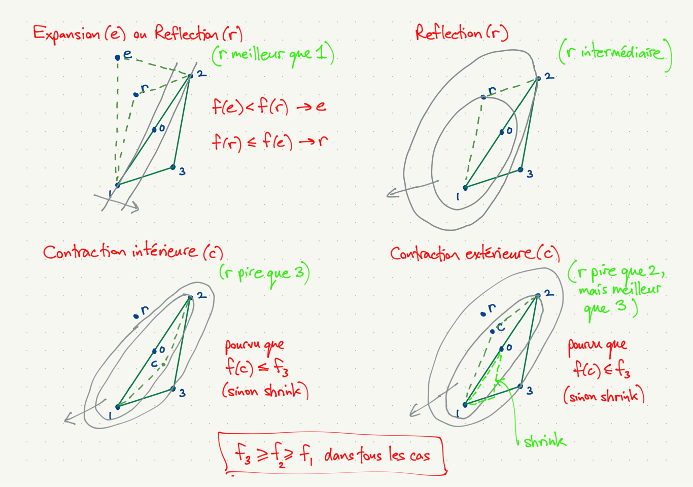

## Survol du cours 4

### Optimisation univariée

1. méthode de dichotomie (bracketing)
1. méthode de Newton (ou de Newton-Raphson)

### Exemple, maximisation du profit d'un monopole

1. valeur, gradient et matrice hessienne du profit
1. code pour les évaluations

### Optimisation multivariée

1. méthode de Nelder-Mead
1. méthode de Newton
1. méthode de "direction set"
    a. direction des axes de coordonnées
    a. direction de descente (opposée au gradient)
    a. direction Newton
    a. direction BFGS

### Mise en oeuvre en R et résultats

## Notes sur l'optimisation univariée

- Utile directement
- Utile pour les problèmes multivariés où la stratégie d'optimisation consiste
en la répetition des étapes suivantes :
    - choix d'une direction de recherche,
    - optimisation univariée dans la direction de recherche (line search).

## Méthode de dichotomie (bracketing) pour un minimum

Il faut commencer dans un état $(a,b,c)$, $a < b < c$ où $f(b) < \min(f(a), f(c))$.

- Si la fonction est continue et cette condition tient, il doit y avoir un minimum local dans l'intervalle $[a,c]$.
- À chaque iteration, on calcule un nouvel état qui remplit les mêmes conditions.
- L'intervalle $[a,c]$ rapetisse à chaque itération.
- On arrête quand $c-a < \epsilon$, où $\epsilon$ mesure la tolerance.

## Une itération de la méthode de dichotomie

Les étapes pour trouver un état $(a',b',c')$, $a' < b' < c'$ où $f(b') < \min(f(a'), f(c'))$ et $c' - a' < c-a$ :

1. Trouver $d$ :
\[
  d = \begin{cases}
    \frac{a + b}{2} & b-a < c-b, \\
    \frac{b + c}{2} & b-a \geq c-b.
  \end{cases}
\]
1. Évaluer $f(d)$.
1. Trouvez $(a',b',c')$ :
\[
  (a',b',c') = \begin{cases}
    (d,b,c) & d < b,\, f(d) > f(b), \\
    (a,d,b) & d < b,\, f(d) < f(b), \\
    (b,d,c) & d > b,\, f(d) < f(b), \\
    (a,b,d) & d > b,\, f(d) > f(b).
  \end{cases}
\]

## Méthode de dichotomie (graphique)


## Notes sur la méthode de dichotomie

### Avantages

- L'intervalle rapetisse toujours par au moins 1/4 par itération.
- Une seule évaluation de $f(\cdot)$ par itération ; pas de dérivées à évaluer.
- Robuste aux fonctions avec des coudes et des parties concaves.

### Désavantages

- On ne peut pas profiter de l'information dans les dérivées.

## Méthode de Newton en une dimension pour un maximum

- Considérez la fonction $f(x) = x - e^x$.
- Les deux premières dérivées sont
\[
  f'(x) = 1-e^x, \quad f''(x) = -e^x
\]
- $f(x)$ est convexe avec un maximum unique à $x=0$.
- L'expansion quadratique de Taylor autour de $x^k$ est
\[
  g(x) = f(x^k) + f'(x^k) (x-x^k) + \tfrac{1}{2} f''(x^k) (x-x^k)^2.
\]
- Le maximum de l'expansion $g$ résoud l'équation $g'(x) = f'(x^k) + f''(x^k)(x-x^k) = 0$.
- La solution de $g'(x^{k+1}) = 0$ est $x^{k+1} = x^k - f'(x^k)/f''(x^k)$.
- Notez que
\[
  -\frac{f'(x)}{f''(x)} = \frac{1-e^x}{e^x}.
\]
- Pour $x^k \ll 0$, $x^{k+1} - x^k \approx e^{-x^k} \gg |x^k|$.
- Pour $x^k \gg 0$, $x^{k+1} - x^k \approx -1$.

## Pas de Newton pour $x=-2,-1,1,2$

```{r Newton_1, echo=FALSE}
x = seq(-2, 2, by=0.001)
plot(x, x-exp(x), type='l', ylim=c(-6, 0))
x_ts = c(-2, -1, 1, 2)
for (x_t in x_ts) {
  val = x_t - exp(x_t)
  der1 = 1 - exp(x_t)
  der2 = - exp(x_t)
  points(x_t, val, col='green')
  lines(x, val + der1*(x-x_t) + 0.5*der2*(x-x_t)^2, col='green')
}
lines(x, x-exp(x))
```

## Un pire cas : minimisation de $f(x) = \log \cosh x$

- $f'(x) = \tanh x$, $f''(x) = (1-\tanh^2 x) > 0$
```{r logcosh}
x = seq(-3, 3, length=101)
plot(x, log(cosh(x)), type='l')
```

## Notes sur la méthode de Newton

### Avantages

- Convergence très rapide près de la solution, où la deuxième dérivée ne change pas beaucoup.

### Désavantages

- La méthode ne marche pas quand la fonction n'est pas concave (max) ou convexe (min).
- Même pour une fonction concave (max) ou convexe (min) $x^k$ peut diverger.
- Il faut calculer deux dérivées de la fonction.

## Quasi-Newton en une dimension

- Supposons que la deuxième dérivée est couteuse.
- Au lieu de calculer
\[
  x^{k+1} - x^k = -f'(x^k)/f''(x^k),
\]
on peut calculer
\[
  x^{k+1} - x^k = -f'(x^k)/h^k,
\]
où
\[
  h^k \equiv \frac{f'(x^k) - f'(x^{k-1})}{x^k - x^{k-1}}.
\]
- $h_k$ est la pente d'une corde qui approxime la pente de la tangente de $f'(x)$ à $x=x^k$.
- Attention : en plusieurs dimensions l'équation analogue $H_k (x^k - x^{k-1}) = \nabla f(x^k) - \nabla f(x^{k-1})$ donne $n$ équations, pas assez pour déterminer $H_k$, $n \times n$ et symétrique.

## Problème du monopole (Judd, page 105)

- Un monopole produit deux biens, en quantités $Y$ et $Z$.

- Les coûts de production sont linéaires
\[
  c_Y(Y) = C_Y Y, \quad c_Z(Z) = C_Z Z,
\]
où $C_Y = 0.62$ et $C_Z = 0.60$.
- La demande est celle d'un consommateur avec utilité
\[
  U(Y,Z) = u(Y,Z) + M = (Y^\alpha + Z^\alpha)^{\eta/\alpha} + M,
\]
où $\alpha = 0.98$, $\eta = 0.85$ et $M$ représente les dépenses en autres biens.
- La demande pour $Y$ et $Z$ est donnée par les équations
\[
  p_Y = u_Y(Y,Z), \quad p_Z = u_Z(Y,Z),
\]
où $p_Y$ et $p_Z$ sont les prix de $Y$ et $Z$.

## Problème du monopole (suite)

- Le problème du monopole est la maximisation du profit :
\[
  \max_{Y,Z\geq 0} \Pi(Y,Z),
\]
où
\[
  \Pi(Y,Z) = Yu_Y(Y,Z) + Zu_Z(Y,Z) - c_Y(Y) - c_Z(Z).
\]
- Le revenu associé à $Y$ est
\[
  Yu_Y(Y,Z)
  = Y \frac{\eta}{\alpha}(Y^\alpha + Z^\alpha)^{(\eta/\alpha) - 1} \alpha Y^{\alpha - 1}
  = \eta(Y^\alpha + Z^\alpha)^{(\eta/\alpha) - 1} Y^\alpha
\]
- Après la même démarche pour $Zu_Z$ on peut écrire
\[
  \begin{aligned}
    \Pi(Y,Z) &= \eta (Y^\alpha + Z^\alpha)^{(\eta/\alpha) - 1}
  (Y^\alpha + Z^\alpha) - c_Y(Y) - c_Z(Z) \\
    &= \eta (Y^\alpha + Z^\alpha)^{\eta/\alpha} - C_Y Y - C_Z Z.
  \end{aligned}
\]

## Le problème en logarithmes de quantité

- Pour éviter l'évaluation de $\Pi$ à $Y<0$ où $Z<0$, soit
$y\equiv \log Y$, $z\equiv \log Z$.
- Notez que $\log(Y^\alpha) = \alpha y$ et $Y^\alpha = e^{\alpha y}$.
- Le problème s'écrit $\max_{y,z} \pi(y,z)$,
où
\[
  \pi(y,z) = \Pi(e^y, e^z) = \eta(e^{\alpha y} + e^{\alpha z})^{\eta/\alpha} - 0.62 e^y - 0.60 e^z.
\]

## Comment faire les graphiques en R

```{r trois-D_setup, warning=FALSE}
source('pi.R')
C = c(0.62, 0.60)         # Coûts marginaux
alpha = 0.98; eta = 0.85  # Paramètres de l'utilité

yz <- as.matrix(expand.grid(seq(-2, 1, length=301),
                            seq(0, 2, length=201)))
colnames(yz) <-c('y', 'z')
df <- data.frame(
  pi_fn = apply(yz, 1, pi_val, C, alpha, eta), yz)
df[1:5,]
```

## Graphique I

```{r trois-D_1}
wireframe(pi_fn ~ y*z, data = df, shade=T)
```

## Graphique II

```{r trois-D_2}
contourplot(pi_fn ~ y*z, data=df, cuts=12)
```

## Graphique III

```{r trois-D_3}
levelplot(pi_fn ~ y*z, data=df, shade=T, col.regions = terrain.colors(100))
```

## Gradient et matrice hessienne du profit du monopole

Valeur :
\(
  \pi(y,z) = \Pi(e^y, e^z) = \eta(e^{\alpha y} + e^{\alpha z})^{\eta/\alpha} - C_Y e^y - C_Z e^z.
\)
Gradient :
\[
  \frac{\partial \pi}{\partial x^\top}
  = \eta^2(e^{\alpha y} + e^{\alpha z})^{(\eta/\alpha) - 1}
  \begin{bmatrix} e^{\alpha y} \\ e^{\alpha z} \end{bmatrix}
  - \begin{bmatrix} C_Ye^y \\ C_Ze^z \end{bmatrix}
\]
Matrice hessienne :
\[
  \begin{aligned}
    \frac{\partial^2 \pi}{\partial x \partial x^\top}
    &= \alpha \eta^2 (\tfrac{\eta}{\alpha}-1)
    (e^{\alpha y} + e^{\alpha z})^{(\eta/\alpha) - 2}
    \begin{bmatrix} e^{\alpha y} \\ e^{\alpha z} \end{bmatrix}
    \begin{bmatrix} e^{\alpha y} & e^{\alpha z} \end{bmatrix} \\
    &+ \alpha \eta^2
    (e^{\alpha y} + e^{\alpha z})^{(\eta/\alpha) - 1}
    \begin{bmatrix} e^{\alpha y} & 0 \\ 0 & e^{\alpha z} \end{bmatrix}
    - \begin{bmatrix} C_Ye^y & 0 \\ 0 & C_Ze^z \end{bmatrix}
  \end{aligned}
\]

## Un formule plus générale

- Soit $f \colon \mathbb{R} \to \mathbb{R}$ et $g \colon \mathbb{R} \to \mathbb{R}^n$.

- Alors
\[
  \frac{\partial f(g(x))}{\partial x}
    = f'(g(x)) \frac{\partial g(x)}{\partial x}
\]
\[
  \frac{\partial^2 f(g(x))}{\partial x \partial x^\top}
    = f''(g(x))
    \frac{\partial g(x)}{\partial x^\top}
    \frac{\partial g(x)}{\partial x}
    + f'(g(x))
    \frac{\partial^2 g(x)}{\partial x \partial x^\top}
\]

## Le calcul du gradient et de la matrice hessienne

```{r monopole}
pi_val_grad_hess <- function(x, C, alpha, eta) {
  eta_sur_al <- eta/alpha; eta2 = eta * eta
  X <- exp(x)           # Vecteur de quantités
  X_al <- exp(alpha*x)  # Vecteur de quantités X_i^alpha
  Q = sum(X_al)
  Q_m2=Q^(eta_sur_al-2); Q_m1=Q_m2*Q; Q_m0=Q_m1*Q
  
  # Valeur v, gradient g, hessienne h du profit pi
  v = eta*Q_m0 - t(C) %*% X
  g = (eta2*Q_m1) * X_al - C*X
  h = (alpha*eta2*(eta_sur_al-1)*Q_m2) * X_al %*% t(X_al) +
      (alpha*eta2*Q_m1) * diag(X_al) - diag(C*X)
  list(valeur=v, gradient=g, hessien=h)
}
```

## Vérification numérique des calculs I

```{r monopole_check_1}
C = c(0.62, 0.60)         # Coûts marginaux
alpha = 0.98; eta = 0.85  # Paramètres de l'utilité

# Point d'expansion, pas, deuxième point d'évaluation
x1 = c(2, 1)
h = c(-0.001, 0.002)
x2 = x1 + h

# Valeur, gradient, matrice hessienne aux points x1, x2
vgh1 = pi_val_grad_hess(x1, C, alpha, eta)
vgh2 = pi_val_grad_hess(x2, C, alpha, eta)

# Valeur à x2 de deux expansions de Taylor autour de x1
v2_1 = vgh1$valeur + vgh1$gradient %*% h
v2_2 = v2_1 + 0.5 * t(h) %*% vgh1$hessien %*% h
```

## Vérification numérique des calculs II

```{r monopole_check_2}
vgh2$valeur - vgh1$valeur
v2_1 - vgh1$valeur
v2_2 - vgh1$valeur
```

## Vérification numérique des calculs III

```{r monopole_check_3}
vgh2$gradient - vgh1$gradient
vgh1$hessien %*% h
```

## Nelder-Mead (méthode de simplex, méthode de polytope)

(Conventions de la page Wikipedia et non du livre de Judd, illustration de la recherche d'un minimum)

En $n$ dimensions, l'état est $x_1,\ldots,x_{n+1}$ (sommets d'un simplexe) tel que
\[
  f(x_1) < f(x_2) < \cdots < f(x_n) < f(x_{n+1}).
\]
Autres points d'intérêt :

- $x_0$, le centroïde des points $x_1,x_2,\ldots,x_n$,
- $x_r = x_0 + \alpha (x_0 - x_{n+1})$, $\alpha > 0$, un point de reflection (r).
- $x_r = x_0 + \gamma (x_0 - x_{n+1})$, $\gamma > \alpha$, un point d'expansion (e).

Une étape donne une autre ensemble de $n+1$ points, qu'il faut trier.

## Nelder-Mead, graphiques



## Notes sur la méthode Nelder-Mead

### Avantages

- Simple à programmer, à comprendre
- Marche pour les fonctions avec des discontinuités, des coudes
- On fournit seulement le code pour évaluer la fonction (pas de gradient, pas de matrice hessienne).

### Inconvénients

- Lente : elle peut prendre beaucoup d'évaluations

## La méthode Newton

La méthode Newton est $x^{k+1} - x^k$ = $-H(x^k)^{-1} \nabla f(x^k)$, où $H(x^k)$ est la matrice hessienne de $f$ évaluée à $x^k$.

### Avantages

- La convergence est quadratique près de la solution.
- Elle marche bien quand la matrice hessienne ne change pas beaucoup
et reste définie positive.
- Il y a des modifications qui surmontent souvent les inconvénients.

### Inconvénients

- Elle marche moins bien quand les valeurs propres de $H(x^k)$ deviennent petites où négatives. (Illustration plus tard.)
- La matrice hessienne est souvent coûteuse à évaluer.

## Méthodes du type "direction set"

L'algorithme générique : faire les étapes suivantes jusqu'à ce que $\|x^k - x^{k+1}\| < \epsilon (1 + \|x^k\|)$, pour les tolérances $\delta$ et $\epsilon$ choisies :

1. Calculer une direction $s^k \in \mathbb{R}^n$.
1. Faire une recherche linéaire : trouver
$\lambda_k = \arg\min_\lambda f(x^k + \lambda s^k)$.
1. $x^{k+1} = x^k + \lambda_k s^k$.

Si $\|\nabla f(x^k)\| < \delta (1+|f(x^k)|)$, réclamer le succès ; sinon, indique la convergence à un point non-optimal.

## Quelques directions possibles (pour un minimum)

### Directions possibles

1. direction des axes de coordonnées : $s^k = e_{(k\,\mathrm{mod}\, n + 1)}$
1. direction opposée au gradient : $s^k = -\nabla f(x^k)$
1. direction Newton : $s^k = -H(x^k)^{-1} \nabla f(x^k)$ 
1. direction BFGS : $s^k = -H_k^{-1} \nabla f(x^k)$ ($H_k$ décrit plus tard)

### Considérations pour faire un choix de direction

1. Coût d'évaluation de $f(x^k)$, $\nabla f(x^k)$ et $H(x^k)$.
1. Coût de $\nabla f$ relatif aux coûts de ses éléments :
    a. un cas extrême : $f(x) = f_1(x_1) + \ldots + f_n(x_n)$.
    a. un cas avec "rendements à l'échelle" : $f(x) = g(h(x))$, avec $g$ et $h$ scalaires : $g'(h(x))$ est un factor commun du gradient.
1. Variations de $H(x)$ et de la courbature de la fonction.
1. Régions de non-convexité.
1. Alignement des vecteurs propres de la matrice hessienne et les axes de coordonnées.
1. Besoin de calculer la matrice hessienne de toute façon?

## Illustration des directions (pour un minimum)

Dans les graphiques suivantes,

- Le point du départ ($x^k$) et le gradient sont normalisés :
    - $x^k = (0,0)$ (vert)
    - $\nabla f(x^k) = (-1,-1)$ (direction en vert)
- La matrice hessienne est spécifié en termes de la décomposition en éléments propres $H = QDQ^\top$ où $Q$ est la matrice de rotation pour une angle $\theta$, $D = \mathrm{diag}(\lambda)$
- En noir :
    - le point $x^{k+1}$ après un pas de Newton
    - la courbe de niveau de l'approximation quadratique
    - les vecteurs propres (directions de courbature maximale et minimale)
- En rouge : la direction de Newton

## Exemple 1

```{r Newton1}
source('conic.R'); grad <- c(-1, -1)
nc <- Newton_conic(grad, theta=pi/8, lambda=c(1, 4))
Newton_plot(grad, nc)
```

## Exemple 2

```{r Newton2}
nc <- Newton_conic(grad, theta=pi/8, lambda=c(0.25, 4))
Newton_plot(grad, nc)
```

## Exemple 3

```{r Newton3}
source('conic.R')
nc <- Newton_conic(grad, theta=pi/8, lambda=c(-0.25, 4))
Newton_plot(grad, nc)
```

## La méthode BFGS (Broyden-Fletcher-Goldfarb-Shanno)

- Les méthodes quasi-Newton (comme BFGS) utilisent une matrice $H_k$ au lieu de la matrice hessienne de la méthode Newton.
- Deux conditions désirables : (les deux tiennent pour BFGS)
    - condition de corde pour $H_k$:
\[
  H_k (x^k - x^{k-1}) = \nabla f(x^k)^\top - \nabla f(x^{k-1})^\top
\]
    - $H_k$ définie positive
    (une garantie que $s_k \equiv -H_k^{-1} \nabla f(x^k)$ est une direction de descente)
- La mise à jour de $H_k$ est
\[
  H_{k+1} = H_k
    - \frac{H_kz_k z_k^\top H_k}{z_k^\top H_k z_k}
    + \frac{y_k y_k^\top}{y_k^\top z_k},
\]
où $z_k = x^{k+1} - x^k$, $y_k = \nabla f(x^{k+1})^\top - \nabla f(x^k)^\top$.

## Mise à jour de rang un

Problème : résoudre la suite de systèmes $y_k = A_k b_k$,
où $A_{k+1} = A_k + u_ku_k^\top$.

La solution directe prend $O(n^3)$ opérations :

- mise à jour $A_k$, $O(n^2)$,
- décomposition de cholesky, $O(n^3)$,
- substitutions avant et arrière, $O(n^2)$.

Une solution plus efficace implique la mise à jour de $A_k^{-1}$,
avec le formule [Sherman-Morrison](https://en.wikipedia.org/wiki/Sherman–Morrison_formula) : 
\[
  (A \pm uu^\top)^{-1} = A^{-1} \mp \frac{A^{-1}uu^\top A^{-1}}{1+u^\top A^{-1} u}.
\]

Calculer $b_k = A_k^{-1} y_k$ prend $O(n^2)$ opération ; La mise à jour, $O(n^2)$ opérations :

- $v = A^{-1}u$, $O(n^2)$,
- Numérateur, $vv^\top$, $O(n^2)$; dénominateur, $1+u^\top v$, $O(n)$.

## Résultats, Nelder-Mead

```{r Nelder-Mead}
source('pi.R')
optim(c(1,1), pi_minus, gr=pi_grad_minus, C, alpha, eta,
      method='Nelder-Mead')
```

## Résultats, BFGS

```{r BFGS}
optim(c(1,1), pi_minus, gr=pi_grad_minus, C, alpha, eta,
      method='BFGS')
```

## Programmation linéaire

Le problème canonique est
\[
  \max_{x \in \mathbb{R}^n} c^\top x
  \; \mbox{tel que} \;
  Ax \leq b, x \geq 0.
\]


## Méthodes par points intérieurs (crédit, Wikipédia)


