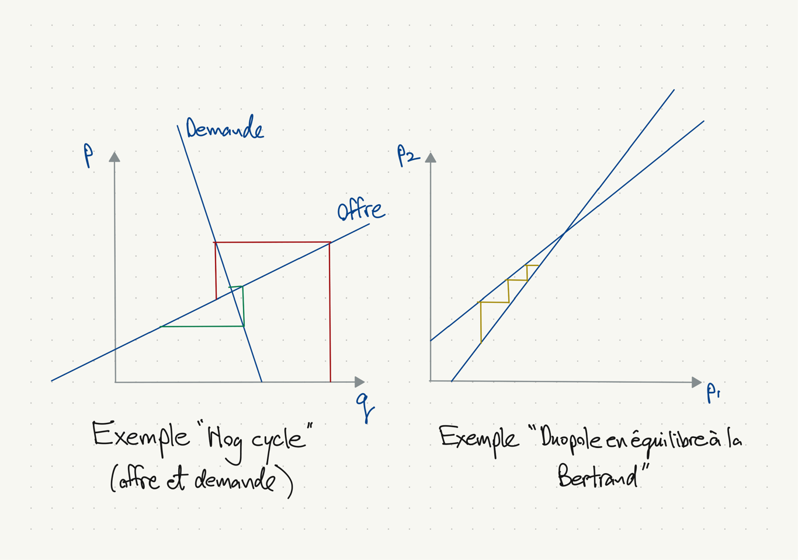

## Applications de la résolution de systèmes linéaires

(Chapitres de « A First Course in Quantitative Economics with Python », QuantEcon)

1. Opérations locales linéaires (provenant des linéarisations) pour résoudre des systèmes d'équations non linéaires. (Cours 4 et 5)
1. (Ch 8) Trouver les prix d'équilibre dans une économie à $n$ biens, où les quantités demandées $q^d = (q_1^d,\ldots,d_n^d)$ et offertes $q^o = (q_1^o,\ldots,d_n^o)$ sont linéaires en prix $p = (p_1,\ldots,p_n)$ :
\[
  q_d = Dp + h, \qquad q_o = Cp + e.
\]
Le vecteur $p^*$ d'équilibre (où $q_d = q_p$) vérifie
\[
  (D-C)p^* = h-e.
\]

## Applications de la résolution de systèmes linéaires (suite)

3. (Ch 11) Trouver une suite de prix d'un actif dans un modèle de valeurs actuelles.
1. (Ch 12) Trouver la suite optimale de détention d'actifs dans un modèle de lissage de la consommation.
1. (Ch 14) Trouver une suite d'inflation dans un modèle monétariste des niveaux de prix.
1. (Ch 15) Même chose, avec anticipations adaptatives.
1. Autres exemples plus tard aujourd'hui.

## Survol du Cours 2

- Problème : trouver le $n$-vecteur $x$ qui résoud le système $Ax = b$. $A$ est $n \times n$ et inversible; $b$ est un $n$-vecteur.
- Les systèmes les plus faciles : $A$ triangulaire ou orthogonal
- Pour les systèmes où $A$ est dense, on peut décomposer $A$ et ainsi réduire le problème en la résolution des systèmes triangulaires et orthogonaux.
- Pour les systèmes où $n$ est grand et $A$ creuse, il y a deux options :
    - utiliser les mêmes décompositions, (attention, les décompositions sont souvent denses)
    - utiliser des méthodes iteratives. (on recourt à ces méthodes pour les systèmes non-linéaires aussi).

## Systèmes triangulaires

- Notation :
    - $L$, une matrice triangulaire inférieure $n \times n$ ; (Left, Lower)
    - $R$ ou $U$, une matrice triangulaire supérieure $n \times n$. (Right, Upper)
- Une matrice triangulaire est inversible ssi aucun élément diagonal n'est nul.
- Pour le $n$-vecteur colonne $b$, la résolution de
    - $Lx = b$ est facile par substitution avant,
    - $Rx = b$ est facile par substitution arrière.
- Pour le $n$-vecteur ligne $b$, la solution de $xL = b$ est la transposée de la solution de $L^\top x^\top = b^\top$.

## Systèmes orthogonaux

- Une matrice $n \times n$ $Q$ est *orthogonal* ssi $Q^{-1} = Q^\top$.
- Définition équivalente : ... ssi $Q^\top Q = QQ^\top = I_n$.
- Exemple, reflections :
\[
  Q = Q^\top = \begin{bmatrix}
    1 & 0 \\
    0 & -1 \\
  \end{bmatrix},\quad
  Q = Q^\top = \begin{bmatrix}
    -1 & 0 \\
    0 & -1 \\
  \end{bmatrix}.
\]
- Exemple, permutation :
\[
  Q = \begin{bmatrix}
    0 & 0 & 1 \\
    1 & 0 & 0 \\
    0 & 1 & 0 \\
  \end{bmatrix},\quad
  Q^\top = \begin{bmatrix}
    0 & 1 & 0 \\
    0 & 0 & 1 \\
    1 & 0 & 0 \\
  \end{bmatrix}.
\]
- Exemple, rotation par un angle $\theta$ :
\[
  Q = \begin{bmatrix}
    \cos \theta & -\sin \theta \\
    \sin \theta & \cos \theta \\
  \end{bmatrix},
\]
\[
  Q^\top = \begin{bmatrix}
    \cos \theta & \sin \theta \\
    -\sin \theta & \cos \theta \\
  \end{bmatrix}
  = \begin{bmatrix}
    \cos -\theta & -\sin -\theta \\
    \sin -\theta & \cos -\theta \\
  \end{bmatrix}
\]

## Systèmes orthogonaux (suite)

Notes :

- La solution du système $Qx = b$ est $x = Q^\top b$.
- Si $Q_1$ et $Q_2$ sont orthogonales,
   - $Q_1^\top$ l'est aussi,
   - $Q_1 Q_2$ l'est aussi :
   \[
     (Q_1Q_2)^\top (Q_1Q_2) = Q_2^\top Q_1^\top Q_1 Q_2 = Q_2^\top Q_2 = I_n,
  \]
  \[
     Q_1Q_2 (Q_1Q_2)^\top = Q_1Q_2 Q_2^\top Q_1^\top = I_n.
  \]
  
## Décompositions

Trois décompositions facilitent la résolution d'un système plus générale en reduisant le problème en la résolution des systèmes triangulaires ou orthogonaux :

- Décomposition LU : $A = LU$ pour $A$ général $n\times n$
- Décomposition Cholesky : $A = LL^\top = R^\top R$, pour $A$ symmétrique et définie positive $n \times n$.
- Décomposition QR : $A = QR$ pour $A$ général $m \times n$

Pensez deux fois avant de calculer l'inverse d'une matrice.

Essayez plutôt de faire une décomposition et ensuite de résoudre un (ou des) système triangulaire ou orthogonal.

En R, préfère `solve(A, b)` à `solve(A) %*% b` pour résoudre le système $Ax = b$.

## La résolution de systèmes avec la décomposition LU

- La décomposition est $A = LU$, où
   - $L$ est triangulaire inférieure $n \times n$.
   - $U$ est triangulaire supérieure $n \times n$.
- En pratique, pour garder contre la division par un nombre près de zéro, il y a une décomposition $A = PLU$, où
    - $P$ est une matrice de permutation (qui est orthogonale).
- Pour résoudre le système $Ax = b$,
    - Calculer la décomposition $A = PLU$. ($(PLU)^{-1} = U^{-1}L^{-1}P^\top$)
    - Le systéme s'écrit $PLUx = b$
    - Permuter $b$ avec $P^\top = P^{-1}$ : $\tilde{b} = P^\top b$.
    - Le système s'écrit $LUx = \tilde{b}$.
    - Résoudre le système $Lz = \tilde{b}$ pour trouver $z \equiv Ux$.
    - Résoudre le système $Ux = z$ pour trouver $x$.
- Pour les systèmes $n \times n$, les décompositions sont $O(n^3)$, les substitutions avant et arrière sont $O(n^2)$ et la multiplication matrice-vecteur est $O(n^2)$.

## Exemple, oligopole (Judd, chapitre 3, exo 7)

Voici les fonctions de meilleure réponse de trois firmes en jeu de Cournot
\[
  q_1 = 5 - 0.5 q_2 - 0.3 q_3,
\]
\[
  q_2 = 7 - 0.6 q_1 - 0.1 q_3,
\]
\[
  q_3 = 4 - 0.2 q_1 - 0.4 q_2.
\]

En équation matriciel $Aq = b$, où
\[
  A = \begin{bmatrix}
    1.0 & 0.5 & 0.3 \\
    0.6 & 1.0 & 0.1 \\
    0.2 & 0.4 & 1.0 \\
  \end{bmatrix},
  \quad
  b = \begin{bmatrix} 5 \\ 7 \\ 4 \end{bmatrix}.
\]

## L'équilibre Cournot, calculé numériquement

```{r Oligo}
data <- c(1.0, 0.6, 0.2, 0.5, 1.0, 0.4, 0.3, 0.1, 1.0)
A <- matrix(data, nrow=3, ncol=3, byrow=FALSE)
b <- c(5, 7, 4)
q <- solve(A, b)
q
```

Notes :

- \texttt{solve} utilise la commande \texttt{DGESV} de \texttt{LAPACK}.
- De la documentation \texttt{LAPACK} : "LU decomposition with partial pivoting and row interchanges"
- En R de base, pas d'accès à la décomposition $PLU$, paraît-il.
- Cependant, si on veut résoudre $Ax^i = b^i$ pour plusieurs $i$,
on peut résoudre $AX = B$, où $X = [x^1 \cdots x^N]$ et $B = [b^1 \cdots b^N]$, avec \texttt{X = solve(A, B)}. La décomposition est faite une seule fois.

## La décomposition QR

Pour une matrice $A$, $n \times n$, la décomposition suivante existe toujours :
\[
  A = QR,
\]
où $Q$ est $n \times n$ orthogonal, $R$ est $n \times n$ triangulaire supérieur.

- Normalisation habituelle : choisir $Q$ pour que les éléments diagonaux de $R$ soient non-négatifs.
- Pour $A$ inversible, la décomposition normalisée est unique.
- Il y a des décompositions analogues QL, RQ, LQ.

Pour une matrice $X$, $n \times k$, $n > k$ (souvent $n \gg k$), on peut faire la décomposition suivante (sans calculer $Q_2$)
\[
  X = QR =
  \begin{bmatrix} Q_1 & Q_2 \end{bmatrix}
  \begin{bmatrix} R_1 \\ 0  \end{bmatrix}
  = Q_1 R_1,
\]
où $Q$ est $n \times n$, $R$ est $n \times k$, $Q_1$ est $n \times k$ et $R_1$ est $k \times k$.

## Une variante de la décomposition QR


## La résolution de systèmes avec la décomposition QR

Pour $A$ carré et inversible, tout est simple :
\[
  A = QR,\quad A^{-1} = R^{-1}Q^\top.
\]

- Écrire le système à résoudre, $Ax = b$, comme $QRx = b$.
- Définir $\tilde{b} = Q^\top b$ et maintenant le système s'écrit
$Rx = \tilde{b}$.
- Résoudre ce système triangulaire avec la substituion arrière.

Pour $A$ grande et mince ($n \gg k$), l'application principale en économie est le calcul de l'estimation MCO (moindres carrées ordinaire).

Autres applications en finance et macro : modèles à facteurs.

## Aparté sur la régression linéaire

- Équation de régression pour l'unité d'observation $i$ :
\[
  y_i = x_{i1} \beta_1 + \ldots + x_{ik} \beta_k + \epsilon_i,
  \quad E[\epsilon_i|x_{i1},\ldots,x_{ik}] = 0.
\]
- Cette équation en vecteurs :
\[
  y_i = x_i^\top \beta + \epsilon_i.
\]
- Toutes les équations, $i=1,\ldots,n$, en matrices :
\[
  y = X\beta + \epsilon,
\]
où $y$ et $\epsilon$ sont $n \times 1$, $X$ est $n \times k$, $\beta$ est $k \times 1$. 
- L'estimation MCO $b$ de $\beta$ est $b = (X^\top X)^{-1} X^\top y$.

## La résolution de systèmes avec la décomposition QR (suite)

- On veut calculer $b \equiv (X^\top X)^{-1} X^\top y$.
- Décompose $X = QR$.
- Rappeler que $QR = Q_1R_1$, pour la sous-matrice $n \times k$ $Q_1$ et la sous-matrice $k\times k$ $R_1$.
- On peut écrire
\[
  \begin{aligned}
    (X^\top X)^{-1} X^\top y
      &= (R^\top Q^\top Q R)^{-1} R^\top Q^\top y \\
      &= (R^\top R)^{-1} R^\top Q^\top y \\
      &= (R_1^\top R_1)^{-1} R_1^\top Q_1^\top y \\
      &= R_1^{-1} (R_1^\top)^{-1} R_1^\top Q_1^\top y \\
      &= R_1^{-1} Q_1^\top y \\
  \end{aligned}
\]
- On n'a pas besoin de $Q_2$ et on peut calculer $Q_1$ sans calculer $Q_2$ (Tant mieux, $Q$ a $n \times n$ éléments à calculer)
- Les résultats sont numériquement plus stables que si on décompose $X^\top X$ par la décomposition Cholesky.

## La décomposition Cholesky

- Soit $\Sigma$ une matrice symmétrique et positive définie $n\times n$.
- La décomposition est $\Sigma = LL^\top = R^\top R$, où
    - $L = R^\top$ est triangulaire inférieure $n \times n$.
- C'est une décomposition de la forme $LU$, mais avec un tiers du nombre de multiplications scalaires de la décomposition $LU$.
- Le calcul est numériquement plus stable, sans recours au pivots.
- $O(n^3)$ multiplications, comme les autres décompositions,
- Deux opérations intéressantes dans le contexte des variables aléatoires gaussiennes multivariées. (La variance $\Sigma = LL^\top$ est positive définie)
    - Multiplication directe $Lx$
    - Résolution du système $Lx = b$.

## Exemple, tirage de variables aléatoires gaussiennes multivariées

Problème : tirer $X \sim N(\mu, \Sigma)$, où $X$ et $\mu$ sont des $n$-vecteurs et la variance $\Sigma$ est $n\times n$ et positive définie.

- La décomposition Cholesky est $\Sigma = LL^\top$.
- Pour $u \sim N(0,I_n)$, $Lu \sim N(0,\Sigma)$, parce que
$LI_nL^\top = LL^\top = \Sigma$.
- Alors $Lu + \mu \sim N(\mu, \Sigma)$.

## Tirage de variables aléatoire $N(\mu, \Sigma)$ en R

```{r MVN}
M = 100  # Nombre de tirages
n = 3    # Nombre d'éléments du vecteur aléatoire
mu = c(4, 1, 3)  # Moyenne mu, variance Sigma
Sigma = matrix(c(4,1,3, 1,1,1.5, 3,1.5,9), nrow=n, ncol=n)
R = chol(Sigma)  # Facteur de Cholesky supérieure

U = matrix(rnorm(n*M), nrow=n, ncol=M) # U_i ~ N(0,I)
X = t(R) %*% U + mu # X_i ~ N(mu, Sigma), i=1,...,M
rowMeans(X)
var(t(X))
```

## Exemple, évaluation de la densité gaussienne multivariée

Si $X \sim N(\mu, \Sigma)$, la densité multivariée est
\[
  f(x) = |\Sigma|^{-1/2} (2\pi)^{-k/2} \exp\left[-\tfrac{1}{2} (x-\mu)^\top \Sigma^{-1} (x-\mu) \right]
\]
Pour calculer $(x-\mu)^\top \Sigma^{-1} (x-\mu)$ :
\[
  \begin{aligned}
    (x-\mu)^\top \Sigma^{-1} (x-\mu)
    &= (x-\mu)^\top (LL^\top)^{-1} (x-\mu) \\
    &= (x-\mu)^\top L^{-\top} L^{-1} (x-\mu) \\
    &= \|L^{-1}(x-\mu)\|^2
  \end{aligned},
\]
et $L^{-1}(x-\mu)$ est la solution du système triangulaire $Lu = (x-\mu)$.

Pour calculer $|\Sigma|$ : $|\Sigma| = |L||L^\top|$ où $|L| = |L^\top| = \prod_{i=1}^n L_{ii}$, parce que $L$ est triangulaire. 

## Une matrice creuse (sparse matrix)

Exemple d'une matrice creuse de la page Wikipédia [Sparse matrix](https://en.wikipedia.org/wiki/Sparse_matrix)

{width=70%}

## Matrice creuse, format triple

Matrice creuse $A$, $m \times n$, avec $N$ éléments ($m=5, n=6, N=5$) :

\[
  A = \begin{bmatrix}
    0 & 0      & A_{13} & 0    & 0      & 0 \\
    0 & 0      & 0      & 0    & 0      & 0 \\
    0 & A_{32} & 0      & 0    & A_{35} & 0 \\
    0 & 0      & A_{43} & 0    & 0      & 0 \\
    0 & A_{52} & 0      & 0    & 0      & 0 \\
  \end{bmatrix}
\]

Triples en ordre colonne par colonne (column major order) :

| $i$ | $j$ | $x$    | $i-1$ | $j-1$ |
|-----|-----|--------|-------|-------|
|  3  |  2  |$A_{32}$|   2   |   1   |
|  5  |  2  |$A_{52}$|   4   |   1   |
|  1  |  3  |$A_{13}$|   0   |   2   |
|  4  |  3  |$A_{43}$|   3   |   2   |
|  3  |  5  |$A_{35}$|   2   |   4   |

## Matrice creuse, format colonne compressée

Éléments de $A$ dans la même ordre, avec index de ligne $i-1$ :

| $i-1$ | $x$    |
|-----|--------|
|  2  |$A_{32}$|
|  4  |$A_{52}$|
|  0  |$A_{13}$|
|  3  |$A_{43}$|
|  2  |$A_{35}$|

Le nombre cumulatif d'éléments de toutes les colonnes $j$ :

| j | 0 | 1 | 2 | 3 | 4 | 5 | 6 |
|---|---|---|---|---|---|---|---|
| p | 0 | 0 | 2 | 4 | 4 | 5 | 5 |

Où est $A_{43}$? Le 2e tableau dit que la colonne 3 de $A$
contient les éléments non-zéro 3 et 4.
On cherche $i-1 = 3$ entre les éléments 3 et 4 du 1er tableau.

## Mise en oeuvre en R, format colonne compressée par défaut

```{r assign_sparse}
library(Matrix)

m <- Matrix(nrow=5, ncol=6, data=0, sparse=TRUE)
m[1, 3] <- 13
m[3, 2] <- 32
m[3, 5] <- 35
m[4, 3] <- 43
m[5, 2] <- 52
m
```

## Représentation en format colonne compressée

```{r compressed_column}
str(m)
```

## Opérations avec les matrices creuses

### Opérations rapides et simples

- Soit \texttt{A} une matrice creuse $m \times n$, $x$ un $n$-vecteur.
- Quand $N = O(n)$ et les éléments sont bien dispersés, la recherche, l'insertion et la suppression (lookup, insertion, deletion) sont des problèmes
    - $O(1)$ pour le format colonne compressée,
    - $O(\log N)$ pour le format triple.
- Opérations rapides :
    - Recherche : \texttt{a <- A[i,j]}
    - Insertion : \texttt{A[i,j] <- a}
    - Suppression : \texttt{A[i,j] <- 0}
    - Multiplication : \texttt{y <- A \%*\% x} ou \texttt{y <- x \%*\% A}

### Opérations lentes ou difficiles

- Les décompositions LU, QR, Cholesky sont possibles (et disponibles en R) mais les résultats sont souvent des matrices denses.

## Multiplication, pour une matrice en format triple

- $A$ est une matrice creuse $m \times n$ avec $N$ éléments non-nuls.
- $x$ est un $n$-vecteur dense.
- On veut calculer le $m$-vecteur dense $y = Ax$.
- Soit $a_i$ la $i$-ème ligne de $A$.
- On peut écrire le vecteur $y$ comme
\[
  y = Ax = \begin{bmatrix} a_1 \\ a_2 \\ \vdots \\ a_m \end{bmatrix}x.
\]
et le scalaire $y_i$, $i=1,\ldots,m$, comme
\[
  y_i = a_i x = \sum_{j=1}^n A_{ij} x_j.
\]
- Pour chaque $A_{ij} \neq 0$, il faut additionner le terme $A_{ij}x_j$ à $y_i$.

## Multiplication, pour une matrice en format triple (suite)

- Algorithme : $y \leftarrow 0$ puis pour $k = 1,\ldots,N$,
\[
  y_{i_k} \leftarrow y_{i_k} + A_{i_k,j_k} x_{j_k}.
\]
- L'algorithme est $O(N)$, qui peut être beaucoup plus rapide que l'algorithme standard pour $A$ dense.
- L'algorithme est légèrement plus compliqué pour le format colonne compressé.

## Autres notes sur les matrices creuses

- Il y a un format ligne compressée (compressed sparse row)
- La page Wikipédia sur les
[matrices creuses](https://en.wikipedia.org/wiki/Sparse_matrix) explique en détail ce format.

## Méthodes itératives linéaires

- Problème : trouver $x^*$, la solution du système $Ax = b$, quand les décompositions sont coûteuses.

- Il y a des méthodes itératives de la forme
\[
  x^{k+1} = \Omega x^k + c.
\]

- Pour que $x^k \to x^*$, il faut que
    1. $x^* = \Omega x^* + c$ (la solution soit un point fixe) et
    2. $\rho(\Omega) < 1$ (toutes les valeurs propres aient une module inférieure à 1)

- Dans ce cas la convergence est linéaire à taux $\beta = \rho(\Omega)$.

## Deux exemples de Judd à voir (pages 80-83)

### Offre et demande (hog cycle)

- Systéme : demande $p + 3q = 21$ et offre $p - 2q = 6$, où $p$ est 
le prix et $q$ est la quantité dans un marché.

- En matrices, après une normalisation qui donne $a_{11} = a_{22} = 1$ :
\[
  \begin{bmatrix} 1 & -\tfrac{1}{2} \\ 3 & 1 \end{bmatrix}
  \begin{bmatrix} q \\ p \end{bmatrix}
  = \begin{bmatrix} -3 \\ 21 \end{bmatrix}
\]

### Duopole en équilibre Bertrand

- Système : meilleures réponses $p_1 = 1 + 0.75p_2$,
$p_2 = 2 + 0.80p_1$, où $p_i$ est le prix choisi par la firme $i$, $i=1,2$.

- En matrices :
\[
  \begin{bmatrix} 1 & -0.75 \\ -0.8 & 1 \end{bmatrix}
  \begin{bmatrix} p_1 \\ p_2 \end{bmatrix}
  = \begin{bmatrix} 1 \\ 2 \end{bmatrix}
\]

## Deux exemples que illustrent les enjeux




## Gauss-Jacobi pour un système $2 \times 2$

Le système $2 \times 2$ s'écrit
\[
  \begin{bmatrix} a_{11} & a_{12} \\ a_{21} & a_{22} \end{bmatrix}
  \begin{bmatrix} x_1 \\ x_2 \end{bmatrix}
  = 
  \begin{bmatrix} b_1 \\ b_2 \end{bmatrix}.
\]

- La première ligne s'écrit $a_{11} x_1 + a_{12} x_2 = b_1$, ce qui motive
\[
  x_1^{k+1} = (b_1 - a_{12} x_2^k) / a_{11}.
\]
- Même chose pour la deuxième ligne donne
\[
  x_2^{k+1} = (b_2 - a_{21} x_1^k) / a_{22}.
\]
- Ensemble, dans la forme $x^{k+1} = \Omega x^k + c$ :
\[
  \begin{bmatrix} x_1^{k+1} \\ x_2^{k+1} \end{bmatrix}
  =
  \begin{bmatrix} 0 & -a_{12}/a_{11} \\ -a_{21}/a_{22} & 0 \end{bmatrix}
  \begin{bmatrix} x_1^k \\ x_2^k \end{bmatrix}
  +
  \begin{bmatrix} b_1/a_{11} \\ b_2/a_{22} \end{bmatrix}.
\]

## Gauss-Seidel pour un système $2 \times 2$

- Ici l'itération pour $x_1$ est pareille :
\[
  x_1^{k+1} = (b_1 - a_{12} x_2^k) / a_{11}.
\]
- L'itération pour $x_2$ utilise $x_1^{k+1}$, déjà calculé, au lieu de $x_1^k$ :
\[
  x_2^{k+1} = (b_2 - a_{21} x_1^{k+1}) / a_{22}.
\]
- Ensemble, dans la forme $x^{k+1} = \Omega x^k + c$ :
\[
  \begin{bmatrix} x_1^{k+1} \\ x_2^{k+1} \end{bmatrix}
  =
  \begin{bmatrix} 0 & -a_{12}/a_{11} \\ 0 & -a_{12}a_{21}/(a_{11}a_{22}) \end{bmatrix}
  \begin{bmatrix} x_1^k \\ x_2^k \end{bmatrix}
  +
  \begin{bmatrix} b_1/a_{11} \\ b_2/a_{22} - \frac{a_{21} b_1}{a_{11}a_{22}} \end{bmatrix}.
\]

## Splitting

Il s'agit d'une méthode générale pour trouver $\Omega$ et $c$ dans l'itération
$x^{k+1} = \Omega x^k + c$.

Décomposer $A = N - P$, et utiliser $\Omega = N^{-1}P$ et $c = N^{-1}b$ pour l'itération $x^{k+1} = \Omega x^k + c$ :
\[
  x^{k+1} = N^{-1}(b + Px^k).
\]

Notes :

- Par construction, $x^*$ est un point fixe : $x^* = N^{-1}(b+Px^*)$.
\[
  Nx^* = b + Px^*, \quad (N-P)x^* = b, \quad Ax^* = b.
\]
- On veut choisir $N$ telle que
    - $\rho(N^{-1}P) < 1$
    - le système $Nx^{k+1} = b + Px^k$ est plus facile à résoudre que le système $Ax = b$.

## Splitting (suite)

- La méthode Gauss-Jacobi est une méthode splitting où
\[
  N = \begin{bmatrix} a_{11} & 0 \\ 0 & a_{22} \end{bmatrix},\;
  P = -\begin{bmatrix} 0 & a_{12} \\ a_{21} & 0 \end{bmatrix},\;
  \Omega = -\begin{bmatrix} 0 & a_{12}/a_{11} \\ a_{21}/a_{22} & 0 \end{bmatrix}.
\]
- Les valeurs propres de $\Omega = N^{-1}P$ sont $\pm \sqrt{a_{12}a_{21}/a_{11}a_{22}}$

- La méthode Gauss-Jacobi est une méthode splitting où
\[
  N = \begin{bmatrix} a_{11} & 0 \\ a_{21} & a_{22} \end{bmatrix},\;
  P = -\begin{bmatrix} 0 & a_{12} \\ 0 & 0 \end{bmatrix},\;
  \Omega = -\begin{bmatrix} 0 & a_{12}/a_{11} \\ 0 & a_{12}a_{21}/(a_{11}a_{22}) \end{bmatrix}.
\]
- Les valeurs propres de $\Omega$ sont $-a_{12}a_{21}/a_{11}a_{22}$ et 0.
