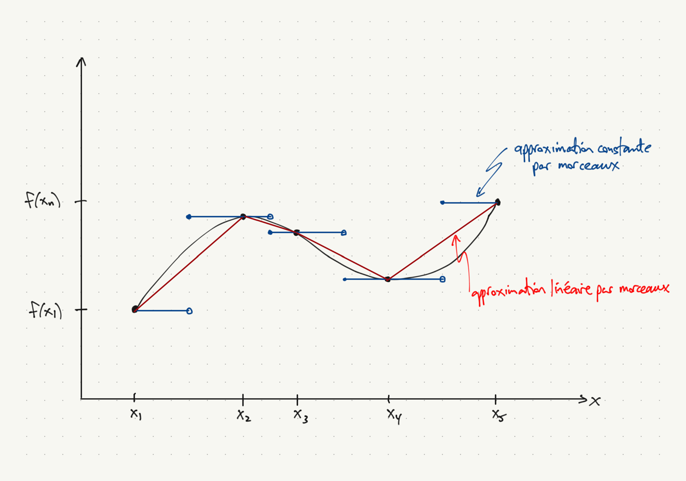

## Survol du cours 6

### Approximations locales, basées sur les dérivées en un seul point

- Approximation de Taylor
- Approximation de Padé

### Expansions basées sur les évaluations sur une grille de points

- Approximation linéaire par morceaux
- Approximation de Bernstein
- Approximation spline cubique d'Hermite

### Expansions basées sur les projections

- Suites de polynômes orthogonaux

## L'approximation (locale) de Taylor

- L'approximation d'une fonction $f(\cdot)$ est autour d'un point $x_0$.
- Elle utilise la valeur $f(x_0)$ et les $n$ premières dérivées $f'(x_0), f''(x_0), \ldots, f^{(n)}(x_0)$.
- L'approximation est
\[
  \hat{f}(x) = f(x_0) + \sum_{i=1}^n \frac{(x-x_0)^i}{i!} f^{(i)}(x_0).
\]
- Les valeurs de $\hat{f}$ et de ses $n$ premières dérivées coïncident avec celles de $f$
au point $x_0$.
- Quel que soit l'ordre $n$, l'approximation demeure locale : il existe une fonction $h_n(x)$ telle que
\[
  f(x) - \hat{f}(x) = h_n(x-x_0) \cdot (x-x_0)^n\,\mbox{et}\,\lim_{x\to x_0} h_n(x) = 0.
\]


## L'approximation (locale) Padé

- L'approximation Padé $\hat f$ de $f$, comme celle de Taylor,
    - utilise la valeur de $f$ et de ses premières $n$ dérivées à $x_0$,
    - concorde avec $f$ sur ces valeurs,
    - comporte $n+1$ coefficients libres.
- L'approximation est une fonction rationnelle, un ratio de polynômes :
\[
  f(x) \approx r(x) \equiv \frac{p(x)}{q(x)}
  = \frac{p_0 + p_1(x-x_0) + \ldots + p_m(x-x_0)^m}{1 + q_1(x-x_0) + \ldots + q_d(x-x_0)^d},
\]
où $m + d = n$ et souvent $m = d$ ou $m = d+1$.
- La condition $f^i(x_0) = r^i(x_0)$, $i=0,1,\ldots,m+n$ s'exprime aussi comme
\[
  p^i(x) - (f \cdot q)^i(x) = 0, \quad i=0,1,\ldots,m+d,
\]
$n+1$ équations pour trouver $n+1 = (m+1) + d$ coefficients.


## Calcul de l'approximation Padé (2,1) de $e^x$ autour de $x=0$

- L'approximation $r(x)$ est
\[
  r(x) = \frac{p_0 + p_1x + p_2x^2}{1 + q_1x}
  = \frac{1 + \tfrac{2}{3} x + \tfrac{1}{6} x^2}{1 - \tfrac{1}{3}x}.
\]
- Les coefficients $p_0$, $p_1$, $p_2$ et $q_1$ sont donnés par
\[
  \left[ (p_0 + p_1x + p_2x^2) - e^x(1 + q_1x) \right]_{x=0} = p_0 - 1 = 0,
\]
\[
  \left[ (p_1 + 2p_2x) - e^x (1 + q_1x) - e^x q_1 \right]_{x=0} = p_1 - 1 - q_1 = 0,
\]
\[
  \left[ 2p_2 - e^x(1 + q_1x) - 2e^x q_1 \right]_{x=0} = 2p_2 - 1 - 2q_1 = 0,
\]
\[
  \left[ -e^x(1 + q_1x) - 3e^x q_1 \right]_{x=0} = -1 - 3q_1 = 0.
\]
- La première équation donne $p_0 = 1$; la dernière, $q_1 = -\tfrac{1}{3}$.
- Ensuite, la deuxième équation donne $p_1 = 1 + q_1 = \tfrac{2}{3}$;
la troisième, $p_2 = \tfrac{1}{2} + q_1 = \tfrac{1}{6}$.

## Notes sur l'approximation Padé

- L'approximation est souvent meilleure que l'approximation de Taylor en pratique.
- Il convient de prêter attention aux zéros de $q(x)$ où l'approximation n'est pas bien définie. Dans l'exemple, $q(x)$ n'est pas bien définie à $x = 3$.


## Exemple I, Taylor et Padé, $f(x) = e^x$, $x_0 = 0$.

Approx. de Taylor (ordres 3, 4, 5, rouge), de Padé ((2,1), vert) :
```{r Taylor_Pade_exp}
source('../Taylor_Pade_exp.R')
```

## Exemple I, erreurs d'approximation

```{r Taylor_Pade_exp_error}
source('../Taylor_Pade_exp_error.R')
```

## Exemple II, approximation de $f(x) = \log x$ à $x_0 = 1$

L'approximation Padé d'ordre (2,1) est
\[
  r(x) = \frac{-\tfrac{5}{2} + 2x + \tfrac{1}{2} x^2}{1 + 2x}.
\]

## Exemple II, Taylor et Padé, $f(x) = \log x$, $x_0 = 1$.

```{r Taylor_Pade_log}
source('../Taylor_Pade_log.R')
```

## Exemple II, erreurs d'approximation

```{r Taylor_Pade_log_error}
source('../Taylor_Pade_log_error.R')
```

## Les approximations fondée sur des évaluations en une grille

- Nous abordons maintenant les approximations fondées sur des évaluations en une grille de points :
    - approximation constante par morceaux
    - approximation linéaire par morceaux
    - approximation de Bernstein (non interpolante)
    - approximation par spline cubique d'hermite

- Les trois premiers utilisent les évaluations $f(x_1),\ldots,f(x_n)$ sur une grille $x_1,\ldots,x_n$ et les approximations $\hat{f}(x)$ sur $[x_1,x_n]$ prennent la forme
\[
  \hat{f}(x) = \sum_{i=1}^n f(x_i) \varphi_i(x).
\]
- Deux propriétés possibles :
    - partition d'unité : $\sum_{i=1} \varphi_i(x) = 1$ pour $x \in [x_1,x_n)$
    - interpolation : $\hat{f}(x_i) = f(x_i)$ pour $i=1,\ldots,n$.

## Approx. constante par morceaux et linéaire par morceaux


## Approximations par morceaux



## Polynômes de Bernstein d'ordre $n=10$

```{r Bernstein, warning=FALSE}
source('../Bernstein.R')
```

## Approximation de Bernstein

- Approximation d'une fonction continue $g \colon [a,b] \to \mathbb{R}$.
- On normalise à $f \colon [0,1] \to \mathbb{R}$ avec $f(x) \equiv g(a+x(b-a))$.
- L'approximation d'ordre $n$ utilise les évaluations de $f$ sur une grille
$(0,\frac{1}{n},\ldots,\frac{n-1}{n},1)$.
- L'approximation est
\[
  \hat{f}_n(x) = \sum_{i=0}^n f(\tfrac{i}{n}) b_{i,n}(x),
\]
où $b_{i,n}(x)$ est le i-ième polynôme de Bernstein de degré $n$ :
\[
  b_{i,n}(x) = {n \choose i} x^i (1-x)^{n-i}.
\]

## Propriétés des approximation de Bernstein

- $b_{i,n}(x)$, $i=0,1,\ldots,n$ est une partition d'unité sur $[0,1]$.
- Convergence uniforme : $\lim_{n\to \infty} \sup_{x \in [0,1]} |f(x) - \hat{f}_n(x)| = 0$.
- $\hat f$ n'est pas une interpolation de $f$ : $\hat f(\tfrac{i}{n}) \neq f(\tfrac{i}{n})$
en général.
- La convergence est lente, mais les dérivées continues existantes convergent également.

## Interprétations probabilistes

- $(n+1) b_{i,n}(x)$ est la densité $\mathrm{Beta}(i+1, n-i+1)$ sur $[0,1]$.
- Pour $\pi_i \geq 0$, $i=0,1,\ldots,n$, $\sum_{i=0}^n \pi_i = 1$, la fonction
suivante est une densité, un mélange de densités Beta :
\[
  g(x) = (n+1) \sum_{i=0}^n \pi_i b_{i,n}(x).
\]
- Soit $G(x) = \int_0^x g(t)\, dt$, la fonction de répartition, un polynôme d'ordre $n+1$.
- Pour une fonction de répartition parmétrique $F(x)$ sur $(-\infty, \infty)$,
$H(x) = G(F(x))$ est une autre fonction de répartition sur $(-\infty, \infty)$.
- La densité est $h(x) = g(F(x)) f(x)$.
- Spécifier $F$ et $G$ revient à définir une loi non paramétrique, une perturbation flexible de la loi avec fonction de répartition $F(x)$.

## Approximation de $g(x) = e^x$ sur l'intervalle $[-2,2]$

```{r bernstein_exp}
# On normalise la fonction g:[-2,2] -> R, où g(x) = exp(x),
# à la fonction f:[0,1] -> R, où f(t) = g(-2 + 4*t)
f <- function(t) {exp(-2 + 4*t)}

# Grille de points t in [0,1]
t <- seq(0, 1, by=0.01)

# Grille de points x in [-2,2]
x <- -2 + 4*t

# Valeurs de f et de g sur la grille
f_grid <- f(t)
```

## Approximation de Bernstein de $g(x) = e^x$ pour $n=10,20$

```{r bernstein_exp_graph, warning=FALSE}
plot(x, f_grid, type='l')
lines(x, bernstein(f, 10, t), col='green')
lines(x, bernstein(f, 20, t), col='red')
```

## Splines cubiques d'hermite

Les splines d’Hermite permettent une interpolation lisse tenant compte des dérivées.

Quatre fonctions cubiques sur l'intervalle $[0,1]$ :
\[
  \varphi_1(t) = 2t^3 - 3t^2 + 1, \quad \varphi_2(t) = t^3 - 2t^2 + t,
\]
\[
  \varphi_3(t) = -2t^3 + 3t^2, \quad \varphi_4(t) = t^3 - t^2.
\]

| Fonction $f$ | $f(0)$ | $f'(0)$ | $f(1)$ | $f'(1)$ |
|--------------|----|----|----|----|
| $\varphi_1$ | 1 | 0 | 0 | 0 |
| $\varphi_2$ | 0 | 1 | 0 | 0 |
| $\varphi_3$ | 0 | 0 | 1 | 0 |
| $\varphi_4$ | 0 | 0 | 0 | 1 |
| $a_1\varphi_1 + a_2\varphi_2 + a_3\varphi_3 + a_4\varphi_4$ | $a_1$ | $a_2$ | $a_3$ | $a_4$ |

## Graphique, spline cubiques d'hermite

```{r Hermite_4}
source('../Hermite_piece.R')
```

## Notes, splines cubiques d'hermite

- Problème : interpoler une fonction dont la valeur et la dérivée sont spécifiées
à quelques points.
- Les données d'entrée :
    - des points $x_1 < x_2 < \ldots < x_n$,
    - des valeurs $f(x_1),\ldots,f(x_n)$,
    - et les dérivées $f'(x_1),\ldots,f'(x_n)$.
- Le résultat : une fonction
    - cubique par morceaux $[x_i,x_{i+1}]$, (piecewise cubic function)
    - $C^1$ dans l'intervalle $[x_1, x_n]$,
    - ayant une deuxième dérivée discontinue à chaque $x_i$.
- Il faut adapter les fonctions $\varphi_j \colon [0,1] \to \mathbb{R}$, $j=1,2,3,4$, pour obtenir les fonctions $\varphi_j \colon [x_i, x_{i+1}] \to \mathbb{R}$.
- Il y a une version (rarement utilisée) avec six fonctions quintiques d'hermite
qui donne une fonction $C^2$ à partir des valeurs, des premières dérivées et des deuxième
dérivées à un ensemble de points.

## Évaluation des splines cubiques d'hermite

```{r spline_cub_herm_eval}
sp_cub_h <- function(x, x_g, f_g, fp_g)
{
  i <- findInterval(x, x_g)
  t <- (x - x_g[i]) / (x_g[i+1] - x_g[i])
  t2 <- t*t; t3 <- t2*t
  fch <- f_g[i] * (2*t3 - 3*t2 + 1) +
    fp_g[i] * (t3 - 2*t2 + t) +
    f_g[i+1] * (-2*t3 + 3*t2) +
    fp_g[i+1] * (t3 - t2)
}

x_grid <- seq(-2, 3, by=1)
f_grid <- exp(2*x_grid)
fp_grid <- 2*f_grid
x <- array(seq(-2, 2, by=0.01))
f_approx <- apply(x, 1, sp_cub_h, x_grid, f_grid, fp_grid)
```

## Évaluation des splines cubiques d'hermite (suite)

```{r spline_cub_herm_eval_suite}
plot(x, exp(2*x), 'l', col='black')
lines(x, f_approx, col='red')
```

## Évaluation des splines cubiques d'hermite (erreur)

```{r spline_cub_herm_eval_erreur}
plot(x, f_approx - exp(2*x), 'l', col='black')
```

## Aparté sur MCO

- Moindres carrées ordinaire (MCO), rappel :
    - $X$ est $n \times K$, $y$ est $n \times 1$.
    - Problème MCO : $b = \arg\min_\beta (y-X\beta)^\top(y-X\beta)$.
    - Solution : $b = (X^\top X)^{-1}(X^\top y)$.
    - $\hat{y} \equiv Xb = (X(X^\top X)^{-1}X^\top) y$ approxime $y$ ($\hat y$ est la combinaison linéaire des colonnes de $X$ le plus près de $y$.

- La matrice $M = X(X^\top X)^{-1}X^\top$ de "projection" :
    - Prenons une combinaison linéaire $Xa$ des colonnes de $X$.
    - Multiplication par $M$ ne change pas $Xa$ :
\[
  M(Xa) = X(X^\top X)^{-1}X^\top Xa = Xa.
\]
    - Prenons $u \in \mathbb{R}^n$ perpendiculaire à toutes les colonnes de $X$ :
\[
  Mu = X(X^\top X)^{-1}X^\top u = X(X^\top X)^{-1} 0 = 0.
\]
    - $M$ projette un vecteur $n \times 1$ sur l'espace engendré par les colonnes de $X$.
    - $\hat{y} = My$ est la projection de $y$ sur cet espace.

## $X$ avec colonnes orthogonales

- Supposons que les colonnes de $X$ soient orthogonales. (Pas réaliste pour les données observées, possible dans le cas où $X$ est une matrice de conception pour une expérience.)
- Alors,
\[
  X^\top X =
  \begin{bmatrix}
    x_1^\top x_1  & 0            & \cdots & 0 \\
    0             & x_2^\top x_2 & \ddots & \vdots \\
    \vdots        & \ddots       & \ddots & 0 \\
    0             & \cdots       & 0      & x_K^\top x_K
  \end{bmatrix},
  \quad
  X^\top y = 
  \begin{bmatrix}
    x_1^\top y \\
    x_2^\top y \\
    \vdots \\
    x_K^\top y
  \end{bmatrix}.
\]
\[
  b_k = \frac{x_k^\top y}{x_k^\top x_k},\; k=1,\ldots,K; \quad
  \hat{y} = Xb = \sum_{k=1}^K \frac{x_k^\top y}{x_k^\top x_k} x_k.
\]
- Chaque $\frac{x_k^\top y}{x_k^\top x} x_k$ est la projection de $y$ sur $x_k$.  
- Notez bien les produits intérieurs $x_k^\top y$, $x_k\top x_k$.

## MCO avec colonnes orthogales et l'approximation par projection

| MCO | Approximation par projection |
|-----------------------|-----------------------|
| vecteur $y$                | fonction $f(\cdot)$ |
| valeurs prédites $\hat{y}$ | approximation $\hat{f}(\cdot)$ |
| vecteurs $x_k$, $k=1,\ldots,K$ | polynômes $\phi_k(\cdot)$, $k=1,\ldots,K$ |
| produit intérieur $x_k^\top y$ | produit intérieur $\langle \phi_k, f \rangle$ |
| colonnes orthogonales $x_k^\top x_l = 0$ | polynômes orthogonales $\langle \phi_k, \phi_l \rangle = 0$. |
| projection de $y$ sur $x_k$ : $\frac{x_k^\top y}{x_k^\top x_k} x_k$ | projection de $f$ sur $\phi_k(\cdot)$ : $\frac{\langle \phi_k, f \rangle}{\langle \phi_k, \phi_k \rangle} \phi_k(\cdot)$ |

## Familles de polynômes orthogonaux : produits intérieurs

- Il y a plusieurs produits intérieurs pour les fonctions,
y compris
\[
  \langle f, g \rangle \equiv \int_a^b f(x) g(x) w(x) \, dx,
\]
pour plusieurs choix de $(a,b)$ et $w \colon [a,b] \to \mathbb{R}$.

- Cas courants

| Nom | $(a,b)$ | $w(x)$ |
|-----|---|--------|
| Jacobi   | $(-1,1)$           | $(1-x)^\alpha (1+x)^\beta$, $\alpha, \beta > -1$ |
| Legendre | $(-1,1)$           | 1 |
| Tchebyshev | $(-1,1)$         | $1/\sqrt{1-x^2}$ |
| Laguerre | $(0,\infty)$       | $e^{-x}$ |
| Hermite  | $(-\infty,\infty)$ | $e^{-x^2}$ | 

- Legendre et Tchebyshev : cas spéciaux de Jacobi.

## Importance de l'orthogonalité

- Un problème de moindres carré : trouver le polynôme d'ordre $n$ qui minimise la distance (selon le produit intérieur spécifié) à une fonction $f \colon (a,b) \to \mathbb{R}$ donnée :
\[
  \min_{p \in {\cal P}_n} \langle f-p, f-p \rangle = \min_{p \in {\cal P}_n} \int_a^b (f(x) - p(x))^2 w(x)\; dx.
\]
- Si on a une famille $\{\varphi_k(x)\}_{k=0}^\infty$ de polynômes orthogonaux
(par rapport à $(a,b)$ et $w(\cdot)$) la solution est
\[
  p(x) = \sum_{k=0}^n
  \frac{\langle f, \varphi_k \rangle}{\langle \varphi_k, \varphi_k \rangle} \varphi_k(x).
\]


## Trouver des polynomes orthogonaux

- Les monômes, $1, x, x^2, \ldots$ ne sont jamais orthogonaux.
- L'algorithme de Gram-Schmidt génère des polynômes orthogonaux (voir Annexe).
- Par example, un choix de produit intérieur donne le système de polynômes orthogonaux Tchebyshev sur $[-1,1]$ :
\[
  T_0 = 1, \quad T_1 = x, \quad T_2 = 2x^2 - 1, \quad T_3 = 4x^3 - 3x, \quad \ldots
\]
- Les polynomes d'ordre pair (impair) sont pairs (impairs).
- Les exercices et les questions d'examen sont plus faciles si on utilise les faits suivants :
    - l'intégral sur $[-a, a]$ d'une fonction impaire est zéro.
    - Le produit d'une fonction paire et une fonction impaire est impair.

## Notes sur les polynômes

- Le théorème de Weierstrass démontre la force potentielle des polynômes
pour l'approximation des fonctions sur les intervalles bornés.

    - Pour $f \in C^k[a,b]$, il existe une suite de polynômes $p_n$, où chaque $p_n$ est
    un polynôme de degré $n$, telle que pour $l \leq k$,
    \[
      \lim_{n \to \infty} \max_{x\in [a,b]} |f^{(l)}(x) - p_n^{(l)}(x)| = 0.
    \]

- Trouvez $p_n(x)$ qui minimise $\max_{x\in [a,b]} |f^{(l)}(x) - p_n^{(l)}(x)|$
est difficile, mais une solution moindres carrés est souvent près du minimum.

- Trouvez $p_n(x)$ qui minimise $\langle f - p_n, f - p_n \rangle$ est facile en
principe, mais
    - les produits intérieurs sont rarement faisables de façon analytique
    - les intégrales numériques sont coûteux

## Approximation moindres carrés de $x^3$

- Problème : approximer $f(x) = x^3$ sur l'intervalle $[-1,1]$.
- Utilisons le produit intérieur avec $(a,b) = (-1,1)$ et $w(x) = 1$.
- Problème moindres carrés : minimiser $\|f-p_2\|^2 = \langle f-p_2, f-p_2 \rangle$ pour 
pour un polynôme $p_2$ d'ordre 2 ou moins.
- La solution est
\[
  \begin{aligned}
    \hat{f}(x) &=
    \frac{\langle f, P_0 \rangle}{\langle P_0, P_0 \rangle} P_0(x)
    + \frac{\langle f, P_1 \rangle}{\langle P_1, P_1 \rangle} P_1(x)
    + \frac{\langle f, P_2 \rangle}{\langle P_2, P_2 \rangle} P_2(x) \\
    &= \frac{2/5}{2/3} P_1(x) = \tfrac{3}{5} x.
  \end{aligned}
\]
- Le polynôme d'ordre 2 ou moins qui minimise $\max_{x \in (-1,1)} |f(x) - p_2(x)|$
est $\tfrac{3}{4} x$.

## Meilleures approximations de $x^3$

```{r x_cube}
x = seq(-1, 1, by=0.001)
plot(x, x^3, type='l')       # Fonction à approximer
lines(x, 0.6*x, col='green') # Meilleur approx. MC
lines(x, 0.75*x, col='red')  # Meilleur approx. uniforme
```

## Meilleures approximations de $x^3$ (suite)

```{r x_cube_error}
x = seq(-1, 1, by=0.001)
plot(x, x^3 - 0.6*x, type='l', col='green') # Meilleur approx. MC
lines(x, x^3 - 0.75*x, col='red')  # Meilleur approx. uniforme
abline(h=-0.25, lty='dashed', col='grey')
```

## Annexe : l'orthogonalisation de polynômes

- Pour un ensemble de vecteurs d'un espace pré-hilbertien
(inner product space), l'algorithme de Gram-Schmidt crée un ensemble de
vecteurs orthogonaux engendrant le même espace.
- L'application de l'algorithme à l'ensemble des monômes donne les formules
de récursion relativement simples.
- Par exemple, les polynômes de Tchebyshev ($(a,b) = (-1,1)$, $w(x) = (1-x^2)^{-1/2}$)
sont définie par $T_0 = 1$, $T_1 = x$, $T_{n+1}(x) = 2xT_n(x) - T_{n-1}(x)$, alors
\[
  T_2(x) = 2xT_1(x) - T_0(x) = 2x^2 - 1,
\]
\[
  T_3(x) = 2xT_2(x) - T_1(x) = 4x^3 - 2x - x = 4x^3 - 3x.
\]
- Pour $n$ pair (impair), $T_n(x)$ est une fonction pair (impair).
- La solution, en forme réduite, est $T_n(x) = \cos(n\cos^{-1} x)$.
- Pour évaluer une expansion $\sum_{k=1}^n a_k T_k(x)$ à un point, on peut
évaluer dans un premier temps, les $T_k(x)$ avec la récursion.

